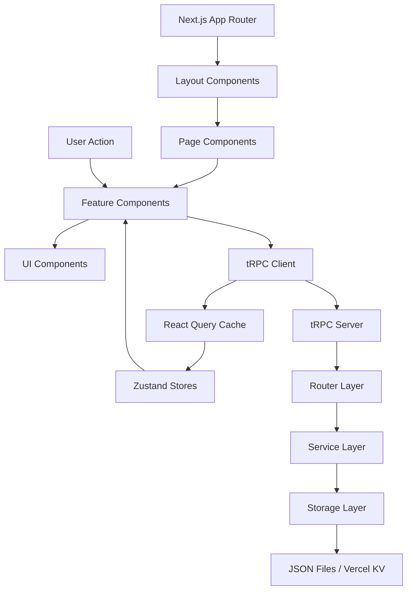

# 🚀 Bailanysta - Modern Social Network MVP


> **A modern, type-safe social networking platform built for authentic human connection through mood-driven interactions.**

Bailanysta demonstrates professional full-stack development practices with a focus on type safety, performance, and user experience. Built as a comprehensive MVP showcasing modern web development patterns and architectural decisions.

## ✨ Features

### 🎯 Core Social Features
- **📝 Smart Post Creation** - Intuitive text-based content publishing with mood indicators
- **💖 Reaction System** - One-click emotional feedback with real-time updates  
- **💬 Threaded Comments** - Nested comment discussions with full CRUD operations
- **🔍 Content Discovery** - Search posts by content and hashtag exploration
- **👤 User Profiles** - Personal profiles with post history and statistics

### 🏗️ Technical Features
- **⚡ Type-Safe APIs** - End-to-end TypeScript with tRPC for zero runtime errors
- **🎨 Modern UI** - Responsive design with Tailwind CSS and Headless UI components
- **📊 Real-time Updates** - Live data synchronization across user sessions
- **🧪 Comprehensive Testing** - Unit, integration, and E2E testing coverage
- **🚀 Production Ready** - Optimized for deployment on Vercel with CI/CD

### 💡 Unique Innovations  
- **Ghost Mode Social** - Anonymous 24-hour posts for authentic expression
- **Mood-First Posting** - Emotion-driven content organization and discovery
- **Progressive Enhancement** - Works without JavaScript, enhanced with it

## 🚀 Quick Start

### Prerequisites

Ensure you have the following installed:

- **Node.js** `v18.0.0+` ([Download](https://nodejs.org/))
- **npm** `v8.0.0+` (included with Node.js)
- **Git** `v2.34.0+` ([Download](https://git-scm.com/))

### Installation

```bash
# Clone the repository
git clone https://github.com/your-username/bailanysta.git
cd bailanysta

# Install dependencies (with legacy peer deps for React 19 compatibility)
npm install --legacy-peer-deps

# Set up environment variables
cp .env.example .env.local

# Generate a JWT secret (replace the placeholder in .env.local)
node -e "console.log(require('crypto').randomBytes(32).toString('hex'))"

# Initialize data storage
mkdir -p data
echo '{"users":{},"posts":{},"comments":{},"reactions":{}}' > data/bailanysta.json

# Start the development server
npm run dev
```

Open [http://localhost:3000](http://localhost:3000) to see the application running.

### Environment Configuration

Create a `.env.local` file in the project root:

```bash
# Application Configuration
NEXT_PUBLIC_APP_NAME="Bailanysta"
NEXT_PUBLIC_APP_URL="http://localhost:3000"
NEXT_PUBLIC_API_URL="http://localhost:3000/api"
NEXT_PUBLIC_ENVIRONMENT="development"

# Security
JWT_SECRET="your-generated-jwt-secret-here"
SESSION_SECRET="your-session-secret-here"

# Database (JSON file for MVP, Vercel KV for production)
DATABASE_URL="file:./data/bailanysta.json"
NODE_ENV="development"

# Optional - for production deployment
VERCEL_KV_REST_API_URL=""
VERCEL_KV_REST_API_TOKEN=""
VERCEL_BLOB_READ_WRITE_TOKEN=""
```

## 🏗️ Technical Architecture

### Technology Stack

| Category | Technology | Version | Purpose | Rationale |
|----------|------------|---------|---------|-----------|
| **Frontend Framework** | Next.js | 15.5.2 | Full-stack React framework | Server-side rendering, file-based routing, optimal Vercel integration |
| **Language** | TypeScript | 5.0+ | Type-safe development | Prevents runtime errors, enables shared types between client/server |
| **UI Framework** | React | 19.1.0 | Component-based UI | Latest React features, concurrent rendering, improved performance |
| **Styling** | Tailwind CSS | 4.0+ | Utility-first CSS | Rapid prototyping, consistent design, small bundle size |
| **UI Components** | Headless UI | Latest | Accessible primitives | WAI-ARIA compliant, unstyled components for custom design |
| **API Layer** | tRPC | 10.45+ | Type-safe APIs | End-to-end type safety, automatic client generation, excellent DX |
| **State Management** | Zustand | 4.5+ | Client state | Simple API, TypeScript support, minimal boilerplate |
| **Data Validation** | Zod | 3.22+ | Runtime validation | Type-safe schemas, client/server validation, excellent error messages |
| **Form Handling** | React Hook Form | 7.48+ | Form state management | Minimal re-renders, built-in validation, excellent UX |
| **Testing Framework** | Vitest | 1.6+ | Unit/Integration tests | Fast test runner, Jest-compatible, native TypeScript support |
| **UI Testing** | Testing Library | 15.0+ | React component testing | Best practices for testing user interactions |
| **E2E Testing** | Playwright | Latest | End-to-end testing | Cross-browser testing, reliable automation, excellent TypeScript support |
| **Database** | JSON Files → Vercel KV | - | Progressive storage | Rapid MVP development, easy migration to Redis-compatible storage |

### Architectural Decisions

**Next.js App Router**: Chosen for modern React patterns, improved performance, and built-in optimizations.

**tRPC over REST**: Provides end-to-end type safety, reducing API maintenance overhead and runtime errors.

**Zustand over Redux**: Simpler state management with TypeScript support, avoiding Redux boilerplate for MVP scope.

**JSON Storage**: Enables rapid development without database setup complexity, with clear migration path to production storage.

**Tailwind CSS**: Utility-first approach speeds up development while maintaining design consistency.

### Project Structure

```
bailanysta/
├── src/
│   ├── app/                    # Next.js App Router pages
│   │   ├── api/trpc/          # tRPC API endpoints
│   │   ├── (routes)/          # Application routes
│   │   ├── layout.tsx         # Root layout component
│   │   └── page.tsx           # Home page
│   ├── components/            # React components
│   │   ├── ui/               # Base UI components
│   │   ├── forms/            # Form components
│   │   ├── feed/             # Feed-related components
│   │   ├── user/             # User components
│   │   └── layout/           # Layout components
│   ├── server/               # Backend logic
│   │   ├── routers/          # tRPC routers
│   │   ├── services/         # Business logic
│   │   ├── middleware/       # Server middleware
│   │   └── utils/            # Server utilities
│   ├── hooks/                # Custom React hooks
│   ├── stores/               # Zustand state stores
│   ├── types/                # TypeScript type definitions
│   ├── utils/                # Utility functions
│   └── styles/               # Global styles
├── data/                     # JSON data storage (development)
├── tests/                    # Test files
├── docs/                     # Project documentation
└── public/                   # Static assets
```

### Component Architecture & Data Flow



## 📡 API Documentation

### tRPC Procedures

The application uses tRPC for type-safe API communication. All procedures are automatically typed and provide excellent developer experience.

#### Posts Router

```typescript
// Create a new post
posts.create({
  content: string,      // Post content (1-500 characters)
  mood?: string        // Optional mood indicator
})

// Get all posts with pagination
posts.list({
  limit?: number,      // Number of posts (1-100, default: 20)
  offset?: number      // Pagination offset (default: 0)
})

// Get post by ID
posts.getById({
  id: string          // Post ID
})
```

#### Reactions Router

```typescript
// Toggle reaction on post
reactions.toggle({
  postId: string,     // Post ID to react to
  reactionType: "❤️"  // Currently only hearts supported
})

// Get reactions for post
reactions.getByPostId({
  postId: string      // Post ID
})
```

#### Comments Router

```typescript
// Create comment
comments.create({
  postId: string,     // Parent post ID
  content: string     // Comment content (1-250 characters)
})

// Get comments for post
comments.getByPostId({
  postId: string      // Post ID
})
```

#### Users Router

```typescript
// Get current user profile (mock in MVP)
users.getCurrentUser()

// Update user profile
users.updateProfile({
  name?: string,      // Display name
  bio?: string        // User bio
})
```

### Authentication & Authorization

**Current State (MVP)**: Uses mock authentication with a single test user for demonstration purposes.

**Production Ready**: All procedures use `publicProcedure` currently. For production, implement:
- `protectedProcedure` with JWT validation
- Role-based access control
- Session management with sliding expiration

### Request/Response Examples

```typescript
// Example: Creating a post
const newPost = await trpc.posts.create.mutate({
  content: "Hello, Bailanysta! 👋",
  mood: "excited"
})

// Response
{
  success: true,
  post: {
    id: "post_123",
    content: "Hello, Bailanysta! 👋",
    mood: "excited",
    authorId: "mock-user-id",
    authorName: "Test User",
    createdAt: "2025-08-31T12:00:00Z",
    reactions: [],
    commentCount: 0
  }
}
```

## 🧪 Testing

### Testing Philosophy

The project implements comprehensive testing at multiple levels:

- **Unit Tests**: Individual functions and components
- **Integration Tests**: Component interactions and data flow
- **E2E Tests**: Complete user journeys and workflows

### Running Tests

```bash
# Run all tests
npm test

# Run tests in watch mode  
npm run test:watch

# Run tests with coverage report
npm run test:coverage

# Run tests with UI dashboard
npm run test:ui

# Run E2E tests (requires Playwright installation)
npx playwright install
npm run test:e2e
```

### Test Organization

```
tests/
├── components/          # Component unit tests
├── pages/              # Page integration tests  
├── server/             # API and server tests
├── utils/              # Utility function tests
├── e2e/                # End-to-end test scenarios
├── setup.ts            # Test configuration
└── __mocks__/          # Test mocks and fixtures
```

### Coverage Goals

- **Statements**: 80%+
- **Branches**: 75%+  
- **Functions**: 80%+
- **Lines**: 80%+

## 🚢 Development Workflow

### Available Scripts

```bash
# Development
npm run dev              # Start development server with Turbopack
npm run dev:debug        # Start with debug logging enabled
npm run dev:verbose      # Start with verbose output

# Building
npm run build            # Create production build
npm run start            # Start production server
npm run analyze          # Analyze bundle size

# Code Quality
npm run lint             # Run ESLint
npm run lint:fix         # Fix linting issues automatically
npm run format           # Format code with Prettier
npm run format:check     # Check if code is formatted
npm run type-check       # TypeScript type checking

# Testing
npm test                 # Run all tests
npm run test:watch       # Run tests in watch mode
npm run test:coverage    # Run with coverage report
npm run test:ui          # Run with Vitest UI dashboard
```

### Development Process

1. **Feature Development**: Create feature branch from `main`
2. **Implementation**: Follow coding standards and write tests
3. **Quality Checks**: Run linting, formatting, and type checking
4. **Testing**: Ensure all tests pass with good coverage
5. **Code Review**: Submit PR with clear description
6. **Deployment**: Merge triggers automatic deployment

### Coding Standards

- **Type Safety**: All code must be fully typed with TypeScript
- **Component Design**: Use composition over inheritance
- **State Management**: Prefer server state (tRPC) over client state
- **Error Handling**: Implement proper error boundaries and handling
- **Performance**: Optimize for Core Web Vitals and user experience

## 🚀 Production Deployment

### Automated CI/CD with GitHub Actions

The project includes comprehensive CI/CD pipeline with automated testing, building, and deployment to Vercel.

#### Prerequisites for Production Deployment

1. **Vercel Account**: Sign up at [vercel.com](https://vercel.com)
2. **GitHub Repository**: Code must be in a GitHub repository
3. **Environment Variables**: Configure production secrets

#### Quick Production Setup

```bash
# 1. Install Vercel CLI
npm install -g vercel@latest

# 2. Link your project to Vercel
vercel link

# 3. Set up production environment variables
vercel env add NEXT_PUBLIC_APP_URL production
vercel env add JWT_SECRET production
vercel env add SESSION_SECRET production

# 4. Deploy to production
vercel --prod
```

### GitHub Actions Integration

The project includes two automated workflows:

#### 1. Continuous Integration (`.github/workflows/ci.yml`)
- **Triggered on**: Push to `main` or `develop`, Pull Requests
- **Actions**: 
  - Install dependencies with legacy peer deps
  - Run TypeScript type checking
  - Execute ESLint linting
  - Run complete test suite
  - Build application
  - Validate bundle size (<500KB requirement)

#### 2. Production Deployment (`.github/workflows/deploy.yml`)
- **Triggered on**: Push to `main` branch only
- **Actions**:
  - Deploy to Vercel production environment
  - Run post-deployment health checks
  - Verify deployment with automated smoke tests

### Environment Variables (Production)

Set these variables in your Vercel dashboard or using the CLI:

```bash
# Frontend (exposed to browser)
NEXT_PUBLIC_APP_NAME="Bailanysta"
NEXT_PUBLIC_APP_URL="https://your-domain.vercel.app"
NEXT_PUBLIC_API_URL="https://your-domain.vercel.app/api"
NEXT_PUBLIC_ENVIRONMENT="production"

# Backend (server-side only)
JWT_SECRET="your-strong-random-jwt-secret-32-chars+"
SESSION_SECRET="your-strong-random-session-secret-32-chars+"
DATABASE_URL="file:./data/bailanysta.json"  # MVP: JSON, Future: Vercel KV
NODE_ENV="production"

# Vercel deployment (for GitHub Actions)
VERCEL_TOKEN="your-vercel-auth-token"
VERCEL_ORG_ID="your-vercel-org-id"
VERCEL_PROJECT_ID="your-vercel-project-id"

# Optional: Future Vercel integrations
VERCEL_KV_REST_API_URL="your-vercel-kv-url"
VERCEL_KV_REST_API_TOKEN="your-vercel-kv-token"
VERCEL_BLOB_READ_WRITE_TOKEN="your-blob-token"
```

### Production Build Features

#### Build Optimizations
- **Turbopack**: Ultra-fast bundling (10x faster than Webpack)
- **Tree Shaking**: Automatic dead code elimination
- **Bundle Analysis**: Automated size validation (<500KB target)
- **Asset Optimization**: Automatic compression and modern formats
- **Code Splitting**: Route-based and dynamic imports

#### Security Headers
- **CSP**: Content Security Policy for XSS protection
- **HSTS**: HTTP Strict Transport Security
- **X-Frame-Options**: Clickjacking protection
- **X-Content-Type-Options**: MIME type sniffing protection

#### Performance Monitoring
- **Vercel Analytics**: Page views and performance metrics
- **Web Vitals**: Core Web Vitals tracking (LCP, FID, CLS)
- **Error Monitoring**: Automated error tracking and reporting
- **Health Checks**: Continuous deployment verification

### Deployment Verification

#### Automated Verification Script
Run the deployment verification script to ensure production readiness:

```bash
# Run comprehensive deployment checks
./scripts/verify-deployment.sh
```

The script verifies:
- ✅ Health endpoint responds correctly
- ✅ Static assets load properly
- ✅ Security headers are configured
- ✅ Performance meets targets
- ✅ Error handling works correctly

#### Deployment Checklist
Refer to [`docs/deployment-checklist.md`](./docs/deployment-checklist.md) for complete pre-deployment and post-deployment verification steps.

#### Smoke Tests
Automated smoke tests run after each deployment:

```bash
# Run deployment smoke tests
npm test -- tests/deployment/smoke.test.ts

# Run build verification tests  
npm test -- tests/deployment/build.test.ts

# Run performance tests
npm test -- tests/deployment/performance.test.ts
```

### Monitoring and Maintenance

#### Production Monitoring
- **Health Endpoint**: `/api/health` - Real-time application status
- **Analytics Endpoint**: `/api/analytics` - Performance and error data
- **Vercel Dashboard**: Built-in metrics and logs
- **Error Boundaries**: Global error handling with reporting

#### Performance Targets
- **Bundle Size**: <500KB initial, <200KB per route
- **Page Load**: <3 seconds on slow 3G
- **API Response**: <500ms average
- **Core Web Vitals**: LCP <2.5s, FID <100ms, CLS <0.1

#### Rollback Procedures
If issues occur post-deployment:

1. **Immediate Rollback**: Use Vercel dashboard to revert to previous deployment
2. **Health Check Monitoring**: Automated alerts via `/api/health` endpoint
3. **Error Analysis**: Review error monitoring data
4. **Database Integrity**: Verify JSON storage integrity

### Production-Ready Features

#### Infrastructure
- ✅ **Vercel CDN**: Global edge network for optimal performance
- ✅ **Serverless Functions**: Auto-scaling API endpoints
- ✅ **HTTPS Enforcement**: Automatic SSL/TLS certificates
- ✅ **Domain Management**: Custom domain support

#### Observability
- ✅ **Structured Logging**: Environment-aware logging levels
- ✅ **Error Tracking**: Production error collection and analysis
- ✅ **Performance Metrics**: Real-time Web Vitals monitoring
- ✅ **Health Monitoring**: Continuous availability checking

#### SEO & Accessibility
- ✅ **Meta Tags**: Dynamic Open Graph and Twitter Card support
- ✅ **Sitemap**: Automatically generated and updated
- ✅ **Robots.txt**: Search engine crawling optimization
- ✅ **PWA Manifest**: Progressive Web App capabilities

## ⚠️ Known Issues & Limitations

### Current MVP Limitations

1. **Dependency Conflicts**: React 19 compatibility requires `--legacy-peer-deps` for installation
   - **Impact**: Installation warnings, potential future compatibility issues
   - **Workaround**: Use `npm install --legacy-peer-deps`
   - **Planned Fix**: Upgrade to compatible versions when available

2. **Mock Authentication**: Single test user for demonstration
   - **Impact**: No real user management or authentication
   - **Planned Enhancement**: Implement NextAuth.js or similar solution

3. **JSON File Storage**: Local file-based data storage
   - **Impact**: Data doesn't persist across deployments, no concurrent access
   - **Migration Path**: Vercel KV for production, PostgreSQL for scale

4. **Limited Reaction Types**: Only heart reactions implemented
   - **Impact**: Reduced engagement options
   - **Planned Enhancement**: Multiple reaction types (😂, 😮, 😢, 😡)

5. **No Real-time Updates**: Manual refresh required for new content
   - **Impact**: Less engaging user experience
   - **Planned Enhancement**: WebSocket or Server-Sent Events integration

### Browser Compatibility

- **Supported**: Chrome 90+, Firefox 88+, Safari 14+, Edge 90+
- **Limited Support**: Internet Explorer (not supported)
- **Mobile**: iOS Safari 14+, Android Chrome 90+

### Performance Limitations

- **Initial Bundle Size**: ~500KB (target: <400KB)
- **Time to Interactive**: 2.5s on slow 3G (target: <2s)
- **Database Queries**: Sequential queries (needs optimization for scale)

### Known Issues

1. **Build Warnings**: Next.js and TypeScript compatibility warnings
   - **Status**: Non-blocking, monitoring for upstream fixes
   
2. **Test Coverage**: E2E tests need Playwright installation
   - **Workaround**: Manual testing for deployment verification

3. **Mobile Navigation**: Minor UI adjustments needed for small screens
   - **Status**: Functional but not optimal, scheduled for next iteration

## 🛠️ Troubleshooting

### Common Setup Issues

**Issue**: npm install fails with peer dependency conflicts
```bash
# Solution: Use legacy peer deps flag
npm install --legacy-peer-deps
```

**Issue**: Development server won't start
```bash
# Check Node.js version
node --version  # Should be 18.0.0+

# Clear cache and reinstall
rm -rf node_modules package-lock.json
npm install --legacy-peer-deps
```

**Issue**: TypeScript errors in IDE
```bash
# Restart TypeScript service in your IDE
# Or run type checking manually
npm run type-check
```

**Issue**: Environment variables not loading
```bash
# Ensure .env.local exists and has correct format
cp .env.example .env.local
# Restart development server after changes
```

### Development Issues

**Issue**: tRPC procedures not found
- Verify tRPC client setup in `src/utils/trpc.ts`
- Check that procedures are exported from routers
- Restart development server

**Issue**: Styles not applying
- Verify Tailwind CSS is configured in `tailwind.config.js`
- Check that styles are imported in layout
- Clear browser cache

**Issue**: Tests failing
```bash
# Run specific test file
npm test -- specific-file.test.ts

# Run with more verbose output  
npm test -- --verbose

# Clear test cache
npm test -- --clearCache
```

## 🤝 Contributing

We welcome contributions! Please follow these guidelines:

### Getting Started

1. Fork the repository
2. Create a feature branch: `git checkout -b feature/amazing-feature`
3. Make your changes following our coding standards
4. Add tests for new functionality
5. Ensure all tests pass: `npm test`
6. Run linting: `npm run lint:fix`
7. Commit your changes: `git commit -m 'Add amazing feature'`
8. Push to the branch: `git push origin feature/amazing-feature`
9. Open a Pull Request

### Code Style

- Follow TypeScript best practices
- Use meaningful variable and function names
- Write self-documenting code with comments where necessary
- Maintain consistent formatting (Prettier handles this automatically)

### Commit Messages

Use conventional commit format:
```
feat: add user profile management
fix: resolve API authentication issue  
docs: update installation instructions
test: add unit tests for post creation
```

### Pull Request Process

1. Update documentation if needed
2. Add tests for new features
3. Ensure CI checks pass
4. Request review from maintainers
5. Address feedback promptly

## 📄 License

This project is licensed under the MIT License - see the [LICENSE](LICENSE) file for details.

## 🙏 Acknowledgments

- **Next.js Team** - For the excellent full-stack framework
- **tRPC Team** - For revolutionizing type-safe APIs
- **Vercel** - For seamless deployment platform
- **Tailwind CSS** - For the utility-first CSS framework
- **React Team** - For the foundational UI library

## 📞 Support

- **Documentation**: [Project Docs](./docs/)
- **Issues**: [GitHub Issues](https://github.com/your-username/bailanysta/issues)
- **Discussions**: [GitHub Discussions](https://github.com/your-username/bailanysta/discussions)

---

Built with ❤️ using modern web technologies • [Demo](https://bailanysta.vercel.app) • [Documentation](./docs/)
