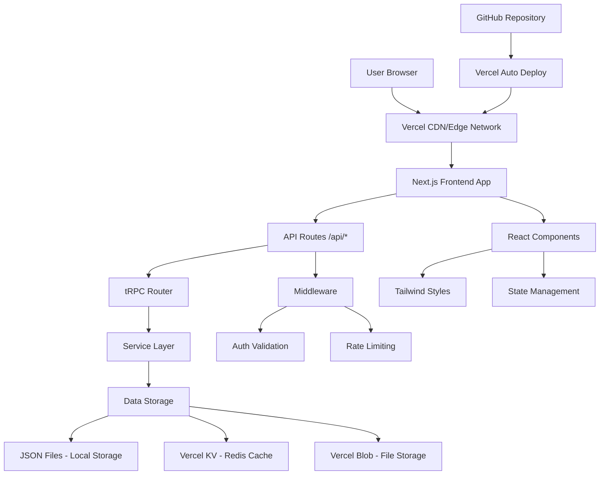
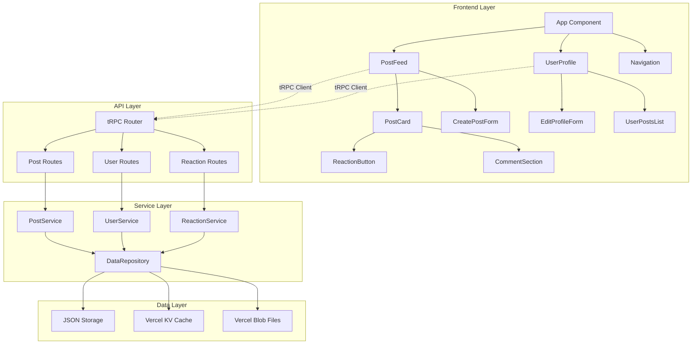
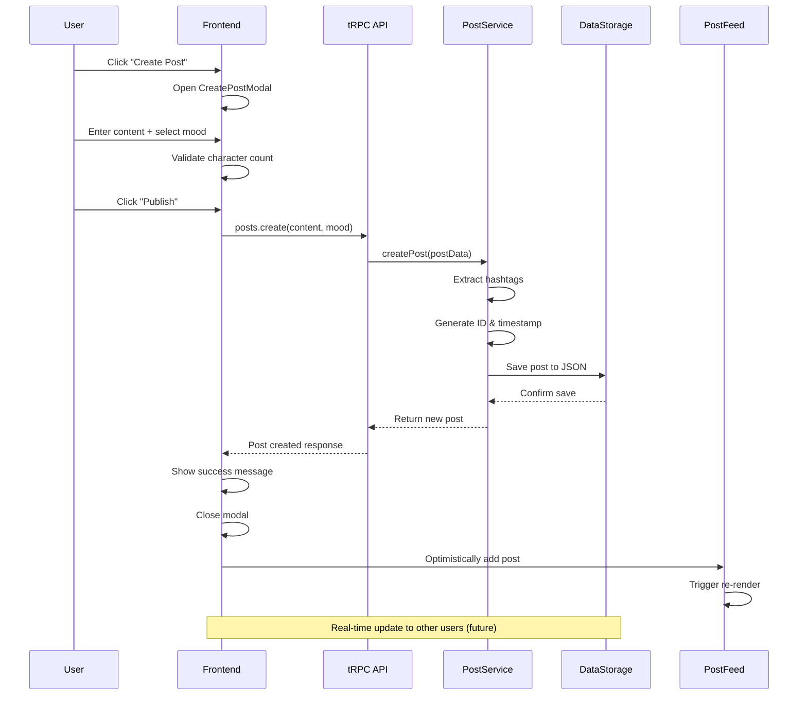
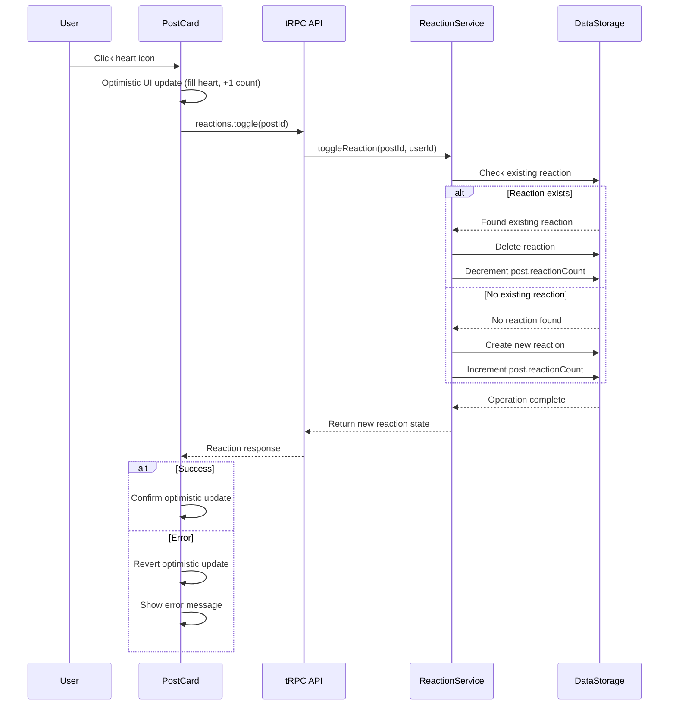
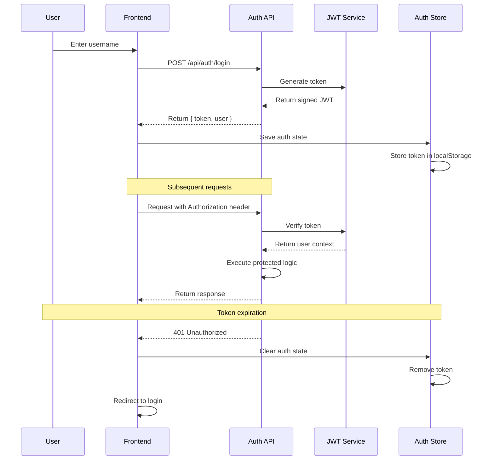
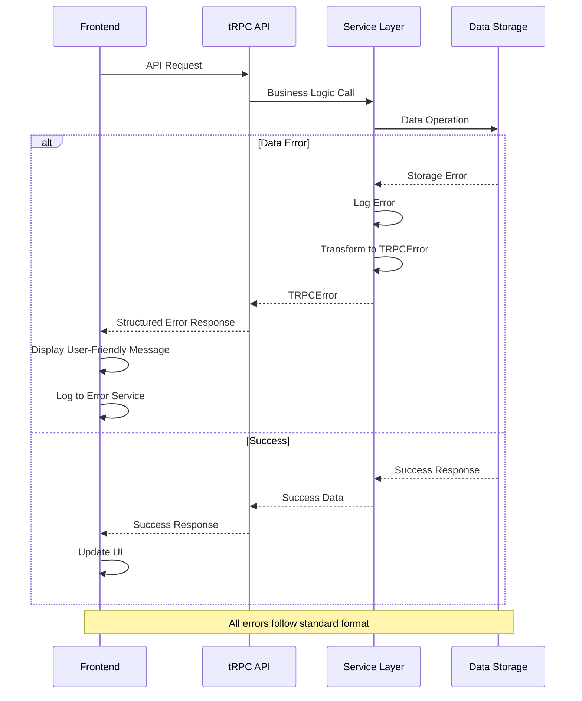

# Bailanysta Fullstack Architecture Document

> **Note:** This document has been sharded for better organization and maintainability. See the individual sections in the `docs/architecture/` folder for detailed content.

## Architecture Sections

- **[Overview](./architecture/overview.md)** - High-level architecture, patterns, and infrastructure choices
- **[Tech Stack](./architecture/tech-stack.md)** - Complete technology stack with rationale
- **[Data Models](./architecture/data-models.md)** - Core data structures and relationships
- **[API Specification](./architecture/api-specification.md)** - tRPC router definitions and external APIs
- **[Components](./architecture/components.md)** - Frontend and backend component architecture
- **[Core Workflows](./architecture/core-workflows.md)** - Key user interaction flows
- **[Database Schema](./architecture/database-schema.md)** - JSON storage and future database schemas
- **[Frontend Architecture](./architecture/frontend-architecture.md)** - React components, state management, routing
- **[Backend Architecture](./architecture/backend-architecture.md)** - Service architecture, data access, authentication
- **[Source Tree](./architecture/source-tree.md)** - Project structure and development workflow
- **[Coding Standards](./architecture/coding-standards.md)** - Development standards and error handling

## Introduction

This document outlines the complete fullstack architecture for Bailanysta, including backend systems, frontend implementation, and their integration. It serves as the single source of truth for AI-driven development, ensuring consistency across the entire technology stack.

This unified approach combines what would traditionally be separate backend and frontend architecture documents, streamlining the development process for modern fullstack applications where these concerns are increasingly intertwined.

### Starter Template or Existing Project

**N/A - Greenfield project**

Based on the PRD requirements for rapid 2-3 hour MVP development, we'll create a greenfield React application optimized for speed. We'll leverage Vite for rapid development, Tailwind for quick styling, and focus on minimal viable architecture that can scale.

### Change Log

| Date | Version | Description | Author |
|------|---------|-------------|---------|
| 2025-08-31 | 1.0 | Initial fullstack architecture based on PRD and front-end specs | Winston (Architect) |

## High Level Architecture

### Technical Summary

Bailanysta employs a modern Jamstack architecture with React frontend and serverless backend, deployed on Vercel for optimal performance and developer experience. The frontend uses React 18 with Vite build tooling and Tailwind CSS for rapid development, while the backend leverages Vercel Edge Functions for API routes with JSON file storage for MVP simplicity. Key integration points include tRPC for type-safe API communication, shared TypeScript interfaces for data consistency, and Vercel's deployment platform for seamless frontend-backend integration. This architecture prioritizes the PRD's 2-3 hour development timeline while maintaining scalable component patterns for future enhancement phases.

### Platform and Infrastructure Choice

**Platform:** Vercel  
**Key Services:** Vercel Edge Functions, Vercel KV (Redis), Vercel Blob Storage, GitHub for CI/CD  
**Deployment Host and Regions:** Global Edge Network with primary regions US-East, EU-West

**Rationale:** Vercel provides optimal integration for React/Next.js applications with zero-config deployment, built-in edge functions for serverless API, and excellent performance. The platform supports the PRD's requirement for free hosting while enabling seamless progression from JSON storage to cloud databases.

### Repository Structure

**Structure:** Monorepo with Frontend-Backend Integration  
**Monorepo Tool:** npm workspaces (lightweight, no additional tooling needed)  
**Package Organization:** Unified Next.js app with API routes, shared types package

**Rationale:** Next.js provides the optimal balance of frontend and backend integration for rapid development, eliminating the complexity of separate repositories while maintaining clear separation of concerns.

### High Level Architecture Diagram



### Architectural Patterns

- **Jamstack Architecture:** Static generation with serverless APIs - _Rationale:_ Optimal performance and scalability for content-heavy social applications with global distribution
- **Component-Based UI:** Reusable React components with TypeScript - _Rationale:_ Maintainability and type safety critical for rapid development and future scaling
- **API-First Design:** tRPC for type-safe client-server communication - _Rationale:_ Eliminates API documentation overhead and provides end-to-end type safety
- **Progressive Enhancement:** Core functionality without JavaScript, enhanced with React - _Rationale:_ Ensures 30-second user validation works even with poor network conditions
- **Edge-First Computing:** API routes run on Vercel Edge Runtime - _Rationale:_ Sub-100ms response times globally, meeting NFR4 performance requirements
- **File-Based Routing:** Next.js pages and API routes - _Rationale:_ Reduces configuration overhead and enables rapid feature development

## Tech Stack

### Technology Stack Table

| Category | Technology | Version | Purpose | Rationale |
|----------|------------|---------|---------|-----------|
| Frontend Language | TypeScript | 5.0+ | Type-safe frontend development | Prevents runtime errors, improves DX, enables shared types |
| Frontend Framework | Next.js | 14.0+ | Full-stack React framework | Combines frontend/backend, optimal Vercel integration, file-based routing |
| UI Component Library | Headless UI + Tailwind | Latest | Accessible component primitives | WAI-ARIA compliant, rapid styling, small bundle size |
| State Management | Zustand | 4.0+ | Lightweight state management | Simple API, TypeScript support, no boilerplate compared to Redux |
| Backend Language | TypeScript | 5.0+ | Unified language stack | Shared types, consistent development experience |
| Backend Framework | Next.js API Routes | 14.0+ | Serverless API endpoints | Zero-config serverless, optimal Vercel deployment |
| API Style | tRPC | 10.0+ | Type-safe API layer | End-to-end type safety, automatic client generation |
| Database | JSON Files → Vercel KV | - | Progressive storage solution | Rapid MVP development, easy migration to Redis |
| Cache | In-Memory → Vercel KV | - | Response caching | Improved performance, reduced API calls |
| File Storage | Local → Vercel Blob | - | Static asset storage | User uploads, profile images in future phases |
| Authentication | Custom JWT | - | Simple token-based auth | No external dependencies for MVP, upgradeable to NextAuth |
| Frontend Testing | Vitest + Testing Library | Latest | Component and integration tests | Fast test runner, React Testing Library for UI |
| Backend Testing | Vitest | Latest | API endpoint testing | Consistent testing stack, TypeScript support |
| E2E Testing | Playwright | Latest | End-to-end user flows | Reliable cross-browser testing, excellent TypeScript support |
| Build Tool | Next.js | 14.0+ | Unified build system | Zero-config, optimized for Vercel deployment |
| Bundler | Turbopack (Next.js) | Latest | Ultra-fast bundling | 10x faster than Webpack, built into Next.js 14 |
| IaC Tool | Vercel CLI | Latest | Deployment configuration | Simple deployment, environment management |
| CI/CD | GitHub Actions | Latest | Automated testing and deployment | Free for public repos, excellent GitHub integration |
| Monitoring | Vercel Analytics | Latest | Performance and error tracking | Built-in analytics, Web Vitals monitoring |
| Logging | Vercel Logs | Latest | Server-side logging | Integrated logging solution |
| CSS Framework | Tailwind CSS | 3.0+ | Utility-first styling | Rapid prototyping, small bundle size, design consistency |

## Data Models

### Core Data Models

#### Post

**Purpose:** Represents user-generated content in the social network feed

**Key Attributes:**
- id: string - Unique post identifier (UUID)
- content: string - Post text content (max 280 characters)
- authorId: string - Reference to user who created the post
- authorName: string - Denormalized author name for performance
- createdAt: Date - Timestamp of post creation
- updatedAt: Date - Timestamp of last modification
- mood?: string - Optional mood indicator (Happy, Thoughtful, Excited, etc.)
- hashtags: string[] - Extracted hashtags from content
- reactionCount: number - Denormalized reaction count
- commentCount: number - Denormalized comment count

##### TypeScript Interface

```typescript
interface Post {
  id: string;
  content: string;
  authorId: string;
  authorName: string;
  createdAt: Date;
  updatedAt: Date;
  mood?: 'Happy' | 'Thoughtful' | 'Excited' | 'Contemplative' | 'Energetic';
  hashtags: string[];
  reactionCount: number;
  commentCount: number;
}
```

##### Relationships
- One-to-many with Comments (post.id → comment.postId)
- One-to-many with Reactions (post.id → reaction.postId)
- Many-to-one with User (post.authorId → user.id)

#### User

**Purpose:** Represents platform users with authentication and profile information

**Key Attributes:**
- id: string - Unique user identifier (UUID)
- username: string - Display name for posts and interactions
- email?: string - Optional email for future authentication
- bio?: string - Optional profile description
- joinedAt: Date - Account creation timestamp
- postCount: number - Denormalized post count
- preferences: UserPreferences - Theme and display preferences

##### TypeScript Interface

```typescript
interface User {
  id: string;
  username: string;
  email?: string;
  bio?: string;
  joinedAt: Date;
  postCount: number;
  preferences: UserPreferences;
}

interface UserPreferences {
  theme: 'light' | 'dark' | 'system';
  language: 'en' | 'ru';
}
```

##### Relationships
- One-to-many with Posts (user.id → post.authorId)
- One-to-many with Comments (user.id → comment.authorId)
- One-to-many with Reactions (user.id → reaction.userId)

#### Comment

**Purpose:** User responses to posts enabling threaded discussions

**Key Attributes:**
- id: string - Unique comment identifier
- content: string - Comment text (max 140 characters)
- postId: string - Reference to parent post
- authorId: string - Comment author reference
- authorName: string - Denormalized author name
- createdAt: Date - Comment timestamp

##### TypeScript Interface

```typescript
interface Comment {
  id: string;
  content: string;
  postId: string;
  authorId: string;
  authorName: string;
  createdAt: Date;
}
```

##### Relationships
- Many-to-one with Post (comment.postId → post.id)
- Many-to-one with User (comment.authorId → user.id)

#### Reaction

**Purpose:** User emotional responses to posts (heart/like system)

**Key Attributes:**
- id: string - Unique reaction identifier
- type: string - Reaction type (currently only 'heart')
- postId: string - Target post reference
- userId: string - User who reacted
- createdAt: Date - Reaction timestamp

##### TypeScript Interface

```typescript
interface Reaction {
  id: string;
  type: 'heart';
  postId: string;
  userId: string;
  createdAt: Date;
}
```

##### Relationships
- Many-to-one with Post (reaction.postId → post.id)
- Many-to-one with User (reaction.userId → user.id)

## API Specification

### tRPC Router Definitions

```typescript
import { z } from 'zod';
import { router, publicProcedure, protectedProcedure } from '../trpc/setup';

// Input schemas
const createPostSchema = z.object({
  content: z.string().min(1).max(280),
  mood: z.enum(['Happy', 'Thoughtful', 'Excited', 'Contemplative', 'Energetic']).optional(),
});

const toggleReactionSchema = z.object({
  postId: z.string().uuid(),
});

const createCommentSchema = z.object({
  postId: z.string().uuid(),
  content: z.string().min(1).max(140),
});

// Main API router
export const appRouter = router({
  // Posts
  posts: router({
    getAll: publicProcedure
      .query(async () => {
        // Returns paginated posts with reactions/comments
        return await postService.getAllPosts();
      }),

    create: protectedProcedure
      .input(createPostSchema)
      .mutation(async ({ input, ctx }) => {
        return await postService.createPost({
          ...input,
          authorId: ctx.user.id,
          authorName: ctx.user.username,
        });
      }),

    update: protectedProcedure
      .input(z.object({
        id: z.string().uuid(),
        content: z.string().min(1).max(280),
      }))
      .mutation(async ({ input, ctx }) => {
        return await postService.updatePost(input.id, input, ctx.user.id);
      }),

    delete: protectedProcedure
      .input(z.object({ id: z.string().uuid() }))
      .mutation(async ({ input, ctx }) => {
        return await postService.deletePost(input.id, ctx.user.id);
      }),

    getByHashtag: publicProcedure
      .input(z.object({ hashtag: z.string() }))
      .query(async ({ input }) => {
        return await postService.getPostsByHashtag(input.hashtag);
      }),
  }),

  // Reactions
  reactions: router({
    toggle: protectedProcedure
      .input(toggleReactionSchema)
      .mutation(async ({ input, ctx }) => {
        return await reactionService.toggleReaction({
          postId: input.postId,
          userId: ctx.user.id,
          type: 'heart',
        });
      }),
  }),

  // Comments
  comments: router({
    create: protectedProcedure
      .input(createCommentSchema)
      .mutation(async ({ input, ctx }) => {
        return await commentService.createComment({
          ...input,
          authorId: ctx.user.id,
          authorName: ctx.user.username,
        });
      }),

    getByPost: publicProcedure
      .input(z.object({ postId: z.string().uuid() }))
      .query(async ({ input }) => {
        return await commentService.getCommentsByPost(input.postId);
      }),
  }),

  // Users
  users: router({
    me: protectedProcedure
      .query(async ({ ctx }) => {
        return ctx.user;
      }),

    updateProfile: protectedProcedure
      .input(z.object({
        username: z.string().min(1).max(50).optional(),
        bio: z.string().max(160).optional(),
      }))
      .mutation(async ({ input, ctx }) => {
        return await userService.updateUser(ctx.user.id, input);
      }),

    getProfile: publicProcedure
      .input(z.object({ userId: z.string().uuid() }))
      .query(async ({ input }) => {
        return await userService.getUserProfile(input.userId);
      }),
  }),

  // Search
  search: router({
    posts: publicProcedure
      .input(z.object({ 
        query: z.string().min(1).max(100),
        limit: z.number().min(1).max(50).default(20),
      }))
      .query(async ({ input }) => {
        return await searchService.searchPosts(input.query, input.limit);
      }),
  }),
});

export type AppRouter = typeof appRouter;
```

## Components

### Frontend Components

#### PostFeed Component

**Responsibility:** Displays chronological list of all posts with infinite scrolling and real-time updates

**Key Interfaces:**
- `useInfiniteQuery` for paginated post loading
- `useMutation` for post creation from embedded form
- WebSocket connection for real-time post updates

**Dependencies:** PostCard, CreatePostForm, InfiniteScroll utilities

**Technology Stack:** React 18 with Suspense, TanStack Query for data fetching, Framer Motion for animations

#### PostCard Component

**Responsibility:** Individual post display with reactions, comments, and management actions

**Key Interfaces:**
- `toggleReaction` mutation for heart interactions
- `deletePost` mutation for post management
- Comment expansion/collapse state management

**Dependencies:** ReactionButton, CommentSection, PostActions

**Technology Stack:** React with optimistic updates, Tailwind for styling, HeadlessUI for accessible interactions

#### UserProfileManager Component

**Responsibility:** User profile display and editing with post management capabilities

**Key Interfaces:**
- `updateProfile` mutation for profile changes
- `getUserPosts` query for user's post history
- Profile image upload (future phase)

**Dependencies:** PostCard, EditProfileForm, UserAvatar

**Technology Stack:** React Hook Form for form management, Zod validation, optimistic UI updates

### Backend Services

#### PostService

**Responsibility:** Core business logic for post creation, retrieval, and management

**Key Interfaces:**
- `createPost(data: CreatePostInput): Promise<Post>`
- `getAllPosts(pagination: PaginationParams): Promise<PostsResponse>`
- `updatePost(id: string, data: UpdatePostInput, userId: string): Promise<Post>`

**Dependencies:** DataRepository, HashtagExtractor, ValidationService

**Technology Stack:** TypeScript service classes, Zod validation, JSON file storage with migration path to Vercel KV

#### ReactionService

**Responsibility:** Manages user reactions to posts with real-time updates

**Key Interfaces:**
- `toggleReaction(data: ReactionInput): Promise<ReactionResponse>`
- `getReactionsByPost(postId: string): Promise<Reaction[]>`
- Real-time reaction count updates

**Dependencies:** DataRepository, NotificationService (future)

**Technology Stack:** Optimistic locking for concurrent reactions, denormalized counters for performance

#### UserService

**Responsibility:** User management, authentication, and profile operations

**Key Interfaces:**
- `createUser(data: CreateUserInput): Promise<User>`
- `updateUser(id: string, data: UpdateUserInput): Promise<User>`
- `getUserProfile(id: string): Promise<UserProfile>`

**Dependencies:** AuthService, ValidationService, ProfileImageService (future)

**Technology Stack:** JWT token management, bcrypt for password hashing (future), profile data validation

### Component Diagrams



## External APIs

Based on the PRD requirements focusing on MVP development with minimal external dependencies, **no external APIs are required for the initial implementation**. The application will function entirely with local data storage and built-in functionality.

**Future Integration Candidates:**
- GitHub API for social login (Epic 3 enhancement)
- Web Push API for notifications (post-MVP)
- Content moderation APIs (scaling phase)

## Core Workflows

### Post Creation and Display Workflow



### Reaction Workflow with Optimistic Updates



## Database Schema

### JSON Storage Schema (MVP Phase)

```json
{
  "users": {
    "user-uuid-1": {
      "id": "user-uuid-1",
      "username": "john_doe",
      "email": "john@example.com",
      "bio": "Passionate about authentic social connections",
      "joinedAt": "2025-08-31T12:00:00Z",
      "postCount": 5,
      "preferences": {
        "theme": "dark",
        "language": "en"
      }
    }
  },
  "posts": {
    "post-uuid-1": {
      "id": "post-uuid-1",
      "content": "Just built my first social network! Excited to see where this goes 🚀 #MVP #coding",
      "authorId": "user-uuid-1",
      "authorName": "john_doe",
      "createdAt": "2025-08-31T12:30:00Z",
      "updatedAt": "2025-08-31T12:30:00Z",
      "mood": "Excited",
      "hashtags": ["MVP", "coding"],
      "reactionCount": 3,
      "commentCount": 1
    }
  },
  "comments": {
    "comment-uuid-1": {
      "id": "comment-uuid-1",
      "content": "Amazing work! Can't wait to try it out 👏",
      "postId": "post-uuid-1",
      "authorId": "user-uuid-2",
      "authorName": "jane_smith",
      "createdAt": "2025-08-31T12:45:00Z"
    }
  },
  "reactions": {
    "reaction-uuid-1": {
      "id": "reaction-uuid-1",
      "type": "heart",
      "postId": "post-uuid-1",
      "userId": "user-uuid-2",
      "createdAt": "2025-08-31T12:35:00Z"
    }
  }
}
```

### Future Vercel KV Schema (Migration Path)

```typescript
// Redis key patterns for Vercel KV
const KEYS = {
  users: (id: string) => `user:${id}`,
  posts: (id: string) => `post:${id}`,
  comments: (postId: string) => `comments:${postId}`,
  reactions: (postId: string) => `reactions:${postId}`,
  userPosts: (userId: string) => `user:${userId}:posts`,
  hashtagPosts: (hashtag: string) => `hashtag:${hashtag}:posts`,
  feed: 'global:feed',
} as const;

// Indexes for efficient querying
const INDEXES = {
  postsByTimestamp: 'idx:posts:timestamp',
  postsByHashtag: (hashtag: string) => `idx:posts:hashtag:${hashtag}`,
  postsByUser: (userId: string) => `idx:posts:user:${userId}`,
} as const;
```

## Frontend Architecture

### Component Architecture

#### Component Organization

```
src/
├── components/           # Reusable UI components
│   ├── ui/              # Base UI components (Button, Input, Modal)
│   ├── forms/           # Form components (CreatePost, EditProfile)
│   ├── feed/            # Feed-related components (PostCard, PostFeed)
│   ├── user/            # User-related components (Profile, Avatar)
│   └── layout/          # Layout components (Navigation, Header)
├── pages/               # Next.js pages and routing
│   ├── index.tsx        # Main feed page
│   ├── profile/         # User profile pages
│   │   └── [userId].tsx # Dynamic profile routes
│   ├── search/          # Search results
│   └── api/             # API routes (tRPC)
├── hooks/               # Custom React hooks
│   ├── useAuth.ts       # Authentication logic
│   ├── usePosts.ts      # Post data management
│   └── useTheme.ts      # Theme switching
├── stores/              # Zustand state stores
│   ├── authStore.ts     # User authentication state
│   ├── uiStore.ts       # UI state (modals, theme)
│   └── postsStore.ts    # Post cache and optimistic updates
├── services/            # API client services
│   ├── api.ts           # tRPC client setup
│   └── storage.ts       # Local storage utilities
├── utils/               # Utility functions
│   ├── validation.ts    # Zod schemas
│   ├── hashtags.ts      # Hashtag extraction
│   └── formatting.ts    # Date/text formatting
└── styles/              # Global styles and themes
    ├── globals.css      # Global Tailwind styles
    └── themes.ts        # Theme configuration
```

#### Component Template

```typescript
import React, { useState } from 'react';
import { Post } from '@/types/shared';
import { trpc } from '@/services/api';
import { useAuthStore } from '@/stores/authStore';
import { HeartIcon } from '@heroicons/react/24/outline';
import { HeartIcon as HeartSolidIcon } from '@heroicons/react/24/solid';

interface PostCardProps {
  post: Post;
  onUpdate?: (post: Post) => void;
}

export const PostCard: React.FC<PostCardProps> = ({ post, onUpdate }) => {
  const { user } = useAuthStore();
  const [isLiked, setIsLiked] = useState(false); // TODO: Get from user reactions
  const [localReactionCount, setLocalReactionCount] = useState(post.reactionCount);

  const toggleReaction = trpc.reactions.toggle.useMutation({
    onMutate: () => {
      // Optimistic update
      setIsLiked(!isLiked);
      setLocalReactionCount(prev => isLiked ? prev - 1 : prev + 1);
    },
    onError: () => {
      // Revert optimistic update on error
      setIsLiked(!isLiked);
      setLocalReactionCount(prev => isLiked ? prev + 1 : prev - 1);
    },
    onSuccess: (data) => {
      // Confirm optimistic update with server state
      setIsLiked(data.isLiked);
      setLocalReactionCount(data.reactionCount);
    },
  });

  const handleReaction = () => {
    if (!user) return;
    toggleReaction.mutate({ postId: post.id });
  };

  return (
    <article className="bg-white dark:bg-gray-800 rounded-lg border border-gray-200 dark:border-gray-700 p-6">
      {/* Post header */}
      <header className="flex items-center justify-between mb-4">
        <div className="flex items-center space-x-3">
          <div className="w-8 h-8 bg-gradient-to-r from-purple-500 to-blue-500 rounded-full flex items-center justify-center text-white font-semibold text-sm">
            {post.authorName[0].toUpperCase()}
          </div>
          <div>
            <h3 className="font-semibold text-gray-900 dark:text-white">{post.authorName}</h3>
            <time className="text-sm text-gray-500 dark:text-gray-400">
              {new Intl.RelativeTimeFormat().format(
                Math.floor((new Date(post.createdAt).getTime() - Date.now()) / (1000 * 60)), 
                'minute'
              )}
            </time>
          </div>
        </div>
        {post.mood && (
          <span className="px-2 py-1 bg-blue-100 dark:bg-blue-900 text-blue-800 dark:text-blue-200 rounded-full text-xs">
            {post.mood}
          </span>
        )}
      </header>

      {/* Post content */}
      <div className="mb-4">
        <p className="text-gray-900 dark:text-white whitespace-pre-wrap">
          {post.content}
        </p>
        {post.hashtags.length > 0 && (
          <div className="mt-2 flex flex-wrap gap-1">
            {post.hashtags.map(hashtag => (
              <button
                key={hashtag}
                className="text-blue-600 dark:text-blue-400 hover:underline text-sm"
                onClick={() => {/* TODO: Navigate to hashtag feed */}}
              >
                #{hashtag}
              </button>
            ))}
          </div>
        )}
      </div>

      {/* Post actions */}
      <footer className="flex items-center space-x-6 pt-2 border-t border-gray-100 dark:border-gray-700">
        <button
          onClick={handleReaction}
          disabled={!user || toggleReaction.isLoading}
          className="flex items-center space-x-2 text-gray-500 hover:text-red-500 transition-colors disabled:opacity-50"
        >
          {isLiked ? (
            <HeartSolidIcon className="w-5 h-5 text-red-500" />
          ) : (
            <HeartIcon className="w-5 h-5" />
          )}
          <span className="text-sm">{localReactionCount}</span>
        </button>

        <button className="flex items-center space-x-2 text-gray-500 hover:text-blue-500 transition-colors">
          <span className="text-sm">{post.commentCount} comments</span>
        </button>
      </footer>
    </article>
  );
};
```

### State Management Architecture

#### State Structure

```typescript
// Auth Store
interface AuthState {
  user: User | null;
  isAuthenticated: boolean;
  isLoading: boolean;
  login: (credentials: LoginCredentials) => Promise<void>;
  logout: () => void;
  updateProfile: (updates: Partial<User>) => Promise<void>;
}

// UI Store
interface UIState {
  theme: 'light' | 'dark' | 'system';
  isCreatePostModalOpen: boolean;
  isProfileEditModalOpen: boolean;
  currentRoute: string;
  setTheme: (theme: UIState['theme']) => void;
  openCreatePostModal: () => void;
  closeCreatePostModal: () => void;
  toggleProfileEditModal: () => void;
}

// Posts Store (for optimistic updates and caching)
interface PostsState {
  posts: Post[];
  isLoading: boolean;
  error: string | null;
  optimisticPosts: Post[]; // For immediate UI updates
  addOptimisticPost: (post: Omit<Post, 'id' | 'createdAt'>) => void;
  confirmOptimisticPost: (tempId: string, post: Post) => void;
  revertOptimisticPost: (tempId: string) => void;
}
```

#### State Management Patterns

- **Optimistic Updates:** Immediate UI feedback for user actions before server confirmation
- **Error Boundaries:** Graceful error handling with user-friendly fallbacks
- **Persistence:** Theme and user preferences saved to localStorage
- **Computed Values:** Derived state for filtered posts, user statistics
- **Async Actions:** Promise-based actions for API calls with loading states
- **State Normalization:** Efficient updates for nested data structures

### Routing Architecture

#### Route Organization

```
pages/
├── index.tsx                 # Main feed (/)
├── profile/
│   ├── index.tsx            # Current user profile (/profile)
│   └── [userId].tsx         # User profile (/profile/[userId])
├── search/
│   └── index.tsx            # Search results (/search?q=...)
├── hashtag/
│   └── [tag].tsx            # Hashtag feed (/hashtag/[tag])
├── api/                     # API routes
│   ├── trpc/
│   │   └── [trpc].ts        # tRPC handler
│   └── auth/
│       ├── login.ts         # Authentication endpoints
│       └── register.ts
├── _app.tsx                 # App wrapper with providers
├── _document.tsx            # HTML document structure
└── 404.tsx                  # Custom 404 page
```

#### Protected Route Pattern

```typescript
import { useAuthStore } from '@/stores/authStore';
import { useRouter } from 'next/router';
import { useEffect } from 'react';

export const withAuth = <P extends object>(Component: React.ComponentType<P>) => {
  const AuthenticatedComponent = (props: P) => {
    const { isAuthenticated, isLoading } = useAuthStore();
    const router = useRouter();

    useEffect(() => {
      if (!isLoading && !isAuthenticated) {
        router.push(`/login?redirect=${router.asPath}`);
      }
    }, [isAuthenticated, isLoading, router]);

    if (isLoading) {
      return (
        <div className="flex items-center justify-center min-h-screen">
          <div className="animate-spin rounded-full h-8 w-8 border-b-2 border-blue-600"></div>
        </div>
      );
    }

    if (!isAuthenticated) {
      return null; // Redirecting...
    }

    return <Component {...props} />;
  };

  AuthenticatedComponent.displayName = `withAuth(${Component.displayName || Component.name})`;
  return AuthenticatedComponent;
};

// Usage in profile page
export default withAuth(function ProfilePage() {
  // Profile component logic
});
```

### Frontend Services Layer

#### API Client Setup

```typescript
import { createTRPCNext } from '@trpc/next';
import { httpBatchLink } from '@trpc/client';
import type { AppRouter } from '../pages/api/trpc/[trpc]';
import { useAuthStore } from '@/stores/authStore';

export const trpc = createTRPCNext<AppRouter>({
  config() {
    return {
      links: [
        httpBatchLink({
          url: '/api/trpc',
          headers: () => {
            const { user } = useAuthStore.getState();
            return user?.token ? { Authorization: `Bearer ${user.token}` } : {};
          },
        }),
      ],
      queryClientConfig: {
        defaultOptions: {
          queries: {
            staleTime: 60 * 1000, // 1 minute
            retry: (failureCount, error: any) => {
              if (error?.data?.httpStatus === 401) return false;
              return failureCount < 3;
            },
          },
        },
      },
    };
  },
  ssr: false, // Disable SSR for MVP simplicity
});
```

#### Service Example

```typescript
// Custom hook for post operations
export const usePosts = () => {
  const { user } = useAuthStore();
  
  const {
    data: posts,
    isLoading,
    error,
    refetch,
  } = trpc.posts.getAll.useQuery();

  const createPost = trpc.posts.create.useMutation({
    onSuccess: () => {
      // Invalidate and refetch posts
      trpc.useContext().posts.getAll.invalidate();
    },
    onError: (error) => {
      console.error('Failed to create post:', error);
    },
  });

  const deletePost = trpc.posts.delete.useMutation({
    onMutate: async (variables) => {
      // Optimistically remove post from UI
      const previousPosts = trpc.useContext().posts.getAll.getData();
      trpc.useContext().posts.getAll.setData(undefined, (oldData) =>
        oldData?.filter(post => post.id !== variables.id) ?? []
      );
      return { previousPosts };
    },
    onError: (error, variables, context) => {
      // Revert optimistic update on error
      if (context?.previousPosts) {
        trpc.useContext().posts.getAll.setData(undefined, context.previousPosts);
      }
    },
    onSettled: () => {
      // Always refetch after mutation
      trpc.useContext().posts.getAll.invalidate();
    },
  });

  return {
    posts: posts ?? [],
    isLoading,
    error,
    refetch,
    createPost: createPost.mutate,
    deletePost: deletePost.mutate,
    isCreating: createPost.isLoading,
    isDeleting: deletePost.isLoading,
  };
};
```

## Backend Architecture

### Service Architecture

Since we're using Next.js with API routes (serverless architecture), we'll organize around function-based services rather than traditional server controllers.

#### Function Organization

```
pages/api/
├── trpc/
│   └── [trpc].ts           # Main tRPC handler
├── auth/
│   ├── login.ts            # Authentication endpoints
│   ├── register.ts
│   └── refresh.ts
├── webhook/
│   └── vercel.ts           # Deployment webhooks
└── health.ts               # Health check endpoint

src/server/
├── routers/                # tRPC route handlers
│   ├── posts.ts           # Post operations
│   ├── users.ts           # User operations
│   ├── reactions.ts       # Reaction operations
│   └── comments.ts        # Comment operations
├── services/              # Business logic
│   ├── postService.ts     # Post management
│   ├── userService.ts     # User management
│   ├── reactionService.ts # Reaction logic
│   └── searchService.ts   # Search functionality
├── middleware/            # Request middleware
│   ├── auth.ts           # JWT validation
│   ├── rateLimit.ts      # Rate limiting
│   └── validation.ts     # Input validation
├── utils/                # Server utilities
│   ├── storage.ts        # Data storage abstraction
│   ├── jwt.ts            # JWT utilities
│   └── errors.ts         # Error handling
└── trpc.ts               # tRPC setup and context
```

#### Function Template

```typescript
// pages/api/trpc/[trpc].ts - Main tRPC handler
import { createNextApiHandler } from '@trpc/server/adapters/next';
import { appRouter } from '../../../server/routers';
import { createTRPCContext } from '../../../server/trpc';

export default createNextApiHandler({
  router: appRouter,
  createContext: createTRPCContext,
  onError: ({ error, type, path, input, ctx, req }) => {
    console.error(`❌ tRPC failed on ${path ?? '<no-path>'}: ${error.message}`);
    
    if (process.env.NODE_ENV === 'development') {
      console.error('Error details:', { type, input, error: error.stack });
    }
  },
});

// Server-side function example
// src/server/services/postService.ts
import { v4 as uuid } from 'uuid';
import { Post, CreatePostInput } from '@/types/shared';
import { storage } from '@/server/utils/storage';
import { extractHashtags } from '@/utils/hashtags';

export class PostService {
  async createPost(input: CreatePostInput & { authorId: string; authorName: string }): Promise<Post> {
    const post: Post = {
      id: uuid(),
      content: input.content,
      authorId: input.authorId,
      authorName: input.authorName,
      createdAt: new Date(),
      updatedAt: new Date(),
      mood: input.mood,
      hashtags: extractHashtags(input.content),
      reactionCount: 0,
      commentCount: 0,
    };

    await storage.posts.create(post);
    return post;
  }

  async getAllPosts(options: { limit?: number; offset?: number } = {}): Promise<Post[]> {
    const { limit = 20, offset = 0 } = options;
    
    const posts = await storage.posts.findMany({
      orderBy: { createdAt: 'desc' },
      limit,
      offset,
    });

    return posts;
  }

  async updatePost(id: string, updates: Partial<Post>, authorId: string): Promise<Post> {
    const existingPost = await storage.posts.findById(id);
    
    if (!existingPost) {
      throw new Error('Post not found');
    }
    
    if (existingPost.authorId !== authorId) {
      throw new Error('Unauthorized to update this post');
    }

    const updatedPost = {
      ...existingPost,
      ...updates,
      updatedAt: new Date(),
      hashtags: updates.content ? extractHashtags(updates.content) : existingPost.hashtags,
    };

    await storage.posts.update(id, updatedPost);
    return updatedPost;
  }

  async deletePost(id: string, authorId: string): Promise<void> {
    const existingPost = await storage.posts.findById(id);
    
    if (!existingPost) {
      throw new Error('Post not found');
    }
    
    if (existingPost.authorId !== authorId) {
      throw new Error('Unauthorized to delete this post');
    }

    await storage.posts.delete(id);
    
    // Clean up associated comments and reactions
    await storage.comments.deleteByPostId(id);
    await storage.reactions.deleteByPostId(id);
  }
}

export const postService = new PostService();
```

### Database Architecture

#### Schema Design

```sql
-- Future migration to PostgreSQL/Vercel Postgres
-- This schema represents the target structure for scaling

CREATE EXTENSION IF NOT EXISTS "uuid-ossp";

-- Users table
CREATE TABLE users (
    id UUID PRIMARY KEY DEFAULT uuid_generate_v4(),
    username VARCHAR(50) NOT NULL UNIQUE,
    email VARCHAR(255) UNIQUE,
    bio TEXT,
    joined_at TIMESTAMP WITH TIME ZONE DEFAULT NOW(),
    post_count INTEGER DEFAULT 0,
    preferences JSONB DEFAULT '{"theme": "light", "language": "en"}'::jsonb,
    created_at TIMESTAMP WITH TIME ZONE DEFAULT NOW(),
    updated_at TIMESTAMP WITH TIME ZONE DEFAULT NOW()
);

-- Posts table
CREATE TABLE posts (
    id UUID PRIMARY KEY DEFAULT uuid_generate_v4(),
    content TEXT NOT NULL CHECK (length(content) <= 280),
    author_id UUID REFERENCES users(id) ON DELETE CASCADE,
    author_name VARCHAR(50) NOT NULL, -- Denormalized for performance
    mood VARCHAR(20),
    hashtags TEXT[] DEFAULT '{}',
    reaction_count INTEGER DEFAULT 0,
    comment_count INTEGER DEFAULT 0,
    created_at TIMESTAMP WITH TIME ZONE DEFAULT NOW(),
    updated_at TIMESTAMP WITH TIME ZONE DEFAULT NOW()
);

-- Comments table
CREATE TABLE comments (
    id UUID PRIMARY KEY DEFAULT uuid_generate_v4(),
    content TEXT NOT NULL CHECK (length(content) <= 140),
    post_id UUID REFERENCES posts(id) ON DELETE CASCADE,
    author_id UUID REFERENCES users(id) ON DELETE CASCADE,
    author_name VARCHAR(50) NOT NULL, -- Denormalized for performance
    created_at TIMESTAMP WITH TIME ZONE DEFAULT NOW()
);

-- Reactions table
CREATE TABLE reactions (
    id UUID PRIMARY KEY DEFAULT uuid_generate_v4(),
    type VARCHAR(10) NOT NULL DEFAULT 'heart',
    post_id UUID REFERENCES posts(id) ON DELETE CASCADE,
    user_id UUID REFERENCES users(id) ON DELETE CASCADE,
    created_at TIMESTAMP WITH TIME ZONE DEFAULT NOW(),
    UNIQUE(post_id, user_id) -- Prevent duplicate reactions
);

-- Indexes for performance
CREATE INDEX idx_posts_created_at ON posts(created_at DESC);
CREATE INDEX idx_posts_author_id ON posts(author_id);
CREATE INDEX idx_posts_hashtags ON posts USING gin(hashtags);
CREATE INDEX idx_comments_post_id ON comments(post_id);
CREATE INDEX idx_reactions_post_id ON reactions(post_id);
CREATE INDEX idx_reactions_user_id ON reactions(user_id);

-- Triggers for maintaining counters
CREATE OR REPLACE FUNCTION update_post_comment_count()
RETURNS TRIGGER AS $$
BEGIN
    IF TG_OP = 'INSERT' THEN
        UPDATE posts SET comment_count = comment_count + 1 WHERE id = NEW.post_id;
        RETURN NEW;
    ELSIF TG_OP = 'DELETE' THEN
        UPDATE posts SET comment_count = comment_count - 1 WHERE id = OLD.post_id;
        RETURN OLD;
    END IF;
    RETURN NULL;
END;
$$ LANGUAGE plpgsql;

CREATE TRIGGER trigger_comment_count
    AFTER INSERT OR DELETE ON comments
    FOR EACH ROW EXECUTE FUNCTION update_post_comment_count();
```

#### Data Access Layer

```typescript
// src/server/utils/storage.ts - Storage abstraction layer
import fs from 'fs/promises';
import path from 'path';
import { Post, User, Comment, Reaction } from '@/types/shared';

// JSON file storage for MVP
class JSONStorage {
  private dataPath = path.join(process.cwd(), 'data');
  private data: {
    users: Record<string, User>;
    posts: Record<string, Post>;
    comments: Record<string, Comment>;
    reactions: Record<string, Reaction>;
  } | null = null;

  async ensureDataDirectory() {
    try {
      await fs.access(this.dataPath);
    } catch {
      await fs.mkdir(this.dataPath, { recursive: true });
    }
  }

  async loadData() {
    if (this.data) return this.data;

    await this.ensureDataDirectory();
    
    try {
      const dataFile = await fs.readFile(path.join(this.dataPath, 'bailanysta.json'), 'utf-8');
      this.data = JSON.parse(dataFile);
    } catch {
      this.data = { users: {}, posts: {}, comments: {}, reactions: {} };
      await this.saveData();
    }

    return this.data;
  }

  async saveData() {
    if (!this.data) return;
    
    await this.ensureDataDirectory();
    await fs.writeFile(
      path.join(this.dataPath, 'bailanysta.json'),
      JSON.stringify(this.data, null, 2)
    );
  }

  // Post operations
  posts = {
    async create(post: Post): Promise<Post> {
      const data = await this.loadData();
      data.posts[post.id] = post;
      await this.saveData();
      return post;
    },

    async findById(id: string): Promise<Post | null> {
      const data = await this.loadData();
      return data.posts[id] || null;
    },

    async findMany(options: {
      orderBy?: { createdAt: 'asc' | 'desc' };
      limit?: number;
      offset?: number;
    } = {}): Promise<Post[]> {
      const data = await this.loadData();
      let posts = Object.values(data.posts);

      if (options.orderBy?.createdAt) {
        posts.sort((a, b) => {
          const aTime = new Date(a.createdAt).getTime();
          const bTime = new Date(b.createdAt).getTime();
          return options.orderBy!.createdAt === 'desc' ? bTime - aTime : aTime - bTime;
        });
      }

      if (options.offset) {
        posts = posts.slice(options.offset);
      }

      if (options.limit) {
        posts = posts.slice(0, options.limit);
      }

      return posts;
    },

    async update(id: string, updates: Partial<Post>): Promise<Post> {
      const data = await this.loadData();
      const existing = data.posts[id];
      if (!existing) throw new Error('Post not found');
      
      const updated = { ...existing, ...updates };
      data.posts[id] = updated;
      await this.saveData();
      return updated;
    },

    async delete(id: string): Promise<void> {
      const data = await this.loadData();
      delete data.posts[id];
      await this.saveData();
    },

    async findByHashtag(hashtag: string): Promise<Post[]> {
      const data = await this.loadData();
      return Object.values(data.posts)
        .filter(post => post.hashtags.includes(hashtag))
        .sort((a, b) => new Date(b.createdAt).getTime() - new Date(a.createdAt).getTime());
    },
  };

  // Similar implementations for users, comments, reactions...
  users = {
    async create(user: User): Promise<User> {
      const data = await this.loadData();
      data.users[user.id] = user;
      await this.saveData();
      return user;
    },

    async findById(id: string): Promise<User | null> {
      const data = await this.loadData();
      return data.users[id] || null;
    },

    async update(id: string, updates: Partial<User>): Promise<User> {
      const data = await this.loadData();
      const existing = data.users[id];
      if (!existing) throw new Error('User not found');
      
      const updated = { ...existing, ...updates };
      data.users[id] = updated;
      await this.saveData();
      return updated;
    },
  };

  comments = {
    async create(comment: Comment): Promise<Comment> {
      const data = await this.loadData();
      data.comments[comment.id] = comment;
      await this.saveData();
      return comment;
    },

    async findByPostId(postId: string): Promise<Comment[]> {
      const data = await this.loadData();
      return Object.values(data.comments)
        .filter(comment => comment.postId === postId)
        .sort((a, b) => new Date(a.createdAt).getTime() - new Date(b.createdAt).getTime());
    },

    async deleteByPostId(postId: string): Promise<void> {
      const data = await this.loadData();
      Object.keys(data.comments).forEach(id => {
        if (data.comments[id].postId === postId) {
          delete data.comments[id];
        }
      });
      await this.saveData();
    },
  };

  reactions = {
    async create(reaction: Reaction): Promise<Reaction> {
      const data = await this.loadData();
      data.reactions[reaction.id] = reaction;
      await this.saveData();
      return reaction;
    },

    async findByPostAndUser(postId: string, userId: string): Promise<Reaction | null> {
      const data = await this.loadData();
      return Object.values(data.reactions)
        .find(r => r.postId === postId && r.userId === userId) || null;
    },

    async delete(id: string): Promise<void> {
      const data = await this.loadData();
      delete data.reactions[id];
      await this.saveData();
    },

    async deleteByPostId(postId: string): Promise<void> {
      const data = await this.loadData();
      Object.keys(data.reactions).forEach(id => {
        if (data.reactions[id].postId === postId) {
          delete data.reactions[id];
        }
      });
      await this.saveData();
    },
  };
}

export const storage = new JSONStorage();
```

### Authentication and Authorization

#### Auth Flow



#### Middleware/Guards

```typescript
// src/server/middleware/auth.ts
import jwt from 'jsonwebtoken';
import { TRPCError } from '@trpc/server';
import { User } from '@/types/shared';

const JWT_SECRET = process.env.JWT_SECRET || 'dev-secret-change-in-production';

export interface AuthContext {
  user: User | null;
  isAuthenticated: boolean;
}

export const createAuthContext = async (
  authorization?: string
): Promise<AuthContext> => {
  if (!authorization?.startsWith('Bearer ')) {
    return { user: null, isAuthenticated: false };
  }

  const token = authorization.split(' ')[1];
  
  try {
    const decoded = jwt.verify(token, JWT_SECRET) as { userId: string; username: string };
    
    // In a real app, fetch user from database
    const user: User = {
      id: decoded.userId,
      username: decoded.username,
      joinedAt: new Date(), // Would come from DB
      postCount: 0, // Would come from DB
      preferences: { theme: 'light', language: 'en' },
    };

    return { user, isAuthenticated: true };
  } catch (error) {
    return { user: null, isAuthenticated: false };
  }
};

// tRPC protected procedure
export const protectedProcedure = publicProcedure.use(({ ctx, next }) => {
  if (!ctx.isAuthenticated || !ctx.user) {
    throw new TRPCError({
      code: 'UNAUTHORIZED',
      message: 'Authentication required',
    });
  }

  return next({
    ctx: {
      ...ctx,
      user: ctx.user, // Type narrowing - user is guaranteed to exist
    },
  });
});

// Rate limiting middleware
interface RateLimitStore {
  [key: string]: { count: number; resetTime: number };
}

const rateLimitStore: RateLimitStore = {};

export const rateLimit = (
  maxRequests: number = 100,
  windowMs: number = 15 * 60 * 1000 // 15 minutes
) => {
  return ({ ctx, next }: { ctx: any; next: any }) => {
    const identifier = ctx.user?.id || ctx.req?.ip || 'anonymous';
    const now = Date.now();
    
    if (!rateLimitStore[identifier] || rateLimitStore[identifier].resetTime < now) {
      rateLimitStore[identifier] = {
        count: 1,
        resetTime: now + windowMs,
      };
    } else {
      rateLimitStore[identifier].count++;
    }

    if (rateLimitStore[identifier].count > maxRequests) {
      throw new TRPCError({
        code: 'TOO_MANY_REQUESTS',
        message: 'Rate limit exceeded',
      });
    }

    return next();
  };
};
```

## Unified Project Structure

```
bailanysta/
├── .github/                    # CI/CD workflows
│   └── workflows/
│       ├── ci.yml             # Test and build pipeline
│       └── deploy.yml         # Vercel deployment
├── src/                       # Main application source
│   ├── components/            # React components
│   │   ├── ui/               # Base UI components
│   │   │   ├── Button.tsx
│   │   │   ├── Input.tsx
│   │   │   ├── Modal.tsx
│   │   │   └── index.ts      # Barrel exports
│   │   ├── forms/            # Form components
│   │   │   ├── CreatePostForm.tsx
│   │   │   ├── EditProfileForm.tsx
│   │   │   └── LoginForm.tsx
│   │   ├── feed/             # Feed components
│   │   │   ├── PostCard.tsx
│   │   │   ├── PostFeed.tsx
│   │   │   ├── ReactionButton.tsx
│   │   │   └── CommentSection.tsx
│   │   ├── user/             # User components
│   │   │   ├── UserProfile.tsx
│   │   │   ├── UserAvatar.tsx
│   │   │   └── UserPostsList.tsx
│   │   └── layout/           # Layout components
│   │       ├── Navigation.tsx
│   │       ├── Header.tsx
│   │       ├── Sidebar.tsx
│   │       └── Layout.tsx
│   ├── pages/                # Next.js pages and API routes
│   │   ├── api/              # API endpoints
│   │   │   ├── trpc/
│   │   │   │   └── [trpc].ts # tRPC handler
│   │   │   ├── auth/
│   │   │   │   ├── login.ts
│   │   │   │   └── register.ts
│   │   │   └── health.ts
│   │   ├── profile/
│   │   │   ├── index.tsx     # Current user profile
│   │   │   └── [userId].tsx  # User profile by ID
│   │   ├── search/
│   │   │   └── index.tsx     # Search results
│   │   ├── hashtag/
│   │   │   └── [tag].tsx     # Hashtag feed
│   │   ├── index.tsx         # Main feed page
│   │   ├── login.tsx         # Login page
│   │   ├── _app.tsx          # App wrapper
│   │   ├── _document.tsx     # HTML document
│   │   └── 404.tsx          # Custom 404
│   ├── server/               # Server-side code
│   │   ├── routers/          # tRPC routers
│   │   │   ├── posts.ts
│   │   │   ├── users.ts
│   │   │   ├── reactions.ts
│   │   │   ├── comments.ts
│   │   │   └── index.ts
│   │   ├── services/         # Business logic
│   │   │   ├── postService.ts
│   │   │   ├── userService.ts
│   │   │   ├── reactionService.ts
│   │   │   └── searchService.ts
│   │   ├── middleware/       # Server middleware
│   │   │   ├── auth.ts
│   │   │   ├── rateLimit.ts
│   │   │   └── validation.ts
│   │   ├── utils/            # Server utilities
│   │   │   ├── storage.ts
│   │   │   ├── jwt.ts
│   │   │   └── errors.ts
│   │   └── trpc.ts          # tRPC setup
│   ├── hooks/               # Custom React hooks
│   │   ├── useAuth.ts
│   │   ├── usePosts.ts
│   │   ├── useTheme.ts
│   │   └── useLocalStorage.ts
│   ├── stores/              # Zustand stores
│   │   ├── authStore.ts
│   │   ├── uiStore.ts
│   │   └── postsStore.ts
│   ├── types/               # TypeScript type definitions
│   │   ├── shared.ts        # Shared types between client/server
│   │   ├── api.ts           # API-specific types
│   │   └── ui.ts            # UI component types
│   ├── utils/               # Utility functions
│   │   ├── validation.ts    # Zod schemas
│   │   ├── hashtags.ts      # Hashtag extraction
│   │   ├── formatting.ts    # Date/text formatting
│   │   └── constants.ts     # App constants
│   └── styles/              # Styling files
│       ├── globals.css      # Global Tailwind styles
│       └── themes.ts        # Theme configuration
├── public/                  # Static assets
│   ├── favicon.ico
│   ├── logo.svg
│   └── images/
├── data/                    # JSON storage (development)
│   └── bailanysta.json      # Main data file
├── tests/                   # Test files
│   ├── components/          # Component tests
│   ├── pages/              # Page tests
│   ├── server/             # Server tests
│   ├── utils/              # Utility tests
│   ├── setup.ts            # Test setup
│   └── __mocks__/          # Test mocks
├── docs/                   # Documentation
│   ├── prd.md
│   ├── front-end-spec.md
│   └── architecture.md
├── .env.example            # Environment variables template
├── .env.local              # Local environment variables
├── .gitignore              # Git ignore rules
├── .eslintrc.json          # ESLint configuration
├── .prettierrc             # Prettier configuration
├── tailwind.config.js      # Tailwind configuration
├── next.config.js          # Next.js configuration
├── tsconfig.json           # TypeScript configuration
├── vitest.config.ts        # Vitest configuration
├── playwright.config.ts    # Playwright configuration
├── vercel.json             # Vercel deployment config
├── package.json            # Dependencies and scripts
└── README.md               # Project documentation
```

## Development Workflow

### Local Development Setup

#### Prerequisites

```bash
# Required software versions
node -v    # v18.0.0 or higher
npm -v     # v8.0.0 or higher
git --version  # v2.34.0 or higher

# Install Node.js (if not installed)
# Option 1: Using nvm (recommended)
curl -o- https://raw.githubusercontent.com/nvm-sh/nvm/v0.39.0/install.sh | bash
nvm install 18
nvm use 18

# Option 2: Download from nodejs.org
# https://nodejs.org/en/download/
```

#### Initial Setup

```bash
# Clone repository and install dependencies
git clone https://github.com/your-username/bailanysta.git
cd bailanysta
npm install

# Copy environment variables
cp .env.example .env.local

# Generate JWT secret (replace in .env.local)
node -e "console.log(require('crypto').randomBytes(32).toString('hex'))"

# Initialize data directory
mkdir -p data
echo '{"users":{},"posts":{},"comments":{},"reactions":{}}' > data/bailanysta.json

# Run initial build to verify setup
npm run build
```

#### Development Commands

```bash
# Start development server (frontend + API)
npm run dev

# Start frontend only (for API debugging)
npm run dev:frontend

# Start in different modes
npm run dev:debug        # With debugging enabled
npm run dev:verbose      # With verbose logging

# Database operations (for production)
npm run db:migrate       # Run database migrations
npm run db:seed         # Seed with sample data

# Testing commands
npm run test            # Run all tests
npm run test:watch      # Run tests in watch mode
npm run test:coverage   # Run tests with coverage
npm run test:e2e        # Run end-to-end tests

# Code quality
npm run lint            # Lint code
npm run lint:fix        # Fix linting issues
npm run type-check      # TypeScript type checking

# Build and deployment
npm run build           # Production build
npm run start           # Start production server
npm run analyze         # Bundle analysis
```

### Environment Configuration

#### Required Environment Variables

```bash
# Frontend (.env.local)
NEXT_PUBLIC_APP_NAME="Bailanysta"
NEXT_PUBLIC_APP_URL="http://localhost:3000"
NEXT_PUBLIC_API_URL="http://localhost:3000/api"
NEXT_PUBLIC_ENVIRONMENT="development"

# Backend (.env.local)
JWT_SECRET="your-super-secret-jwt-key-here"
SESSION_SECRET="your-session-secret-here"
DATABASE_URL="file:./data/bailanysta.json" # For JSON storage
NODE_ENV="development"

# Optional - for future integrations
VERCEL_KV_REST_API_URL=""
VERCEL_KV_REST_API_TOKEN=""
VERCEL_BLOB_READ_WRITE_TOKEN=""

# Development tools
ANALYZE_BUNDLE="false"
DEBUG_MODE="false"
```

## Deployment Architecture

### Deployment Strategy

**Frontend Deployment:**
- **Platform:** Vercel (automatic GitHub integration)
- **Build Command:** `npm run build`
- **Output Directory:** `.next`
- **CDN/Edge:** Global Edge Network with automatic optimization

**Backend Deployment:**
- **Platform:** Vercel Edge Functions (serverless)
- **Build Command:** `npm run build` (same as frontend)
- **Deployment Method:** API Routes deployed as Edge Functions
- **Region:** Automatically deployed to all Vercel edge locations

**Storage Deployment:**
- **Development:** JSON files in `/data` directory
- **Production:** Vercel KV (Redis) for data, Vercel Blob for files
- **Migration:** Automatic migration scripts for data format conversion

### CI/CD Pipeline

```yaml
# .github/workflows/ci.yml
name: CI/CD Pipeline

on:
  push:
    branches: [main, develop]
  pull_request:
    branches: [main]

jobs:
  test:
    runs-on: ubuntu-latest
    
    steps:
      - uses: actions/checkout@v4
      
      - name: Setup Node.js
        uses: actions/setup-node@v4
        with:
          node-version: '18'
          cache: 'npm'
      
      - name: Install dependencies
        run: npm ci
      
      - name: Run type checking
        run: npm run type-check
      
      - name: Run linting
        run: npm run lint
      
      - name: Run unit tests
        run: npm run test
      
      - name: Run E2E tests
        run: npm run test:e2e
        env:
          PLAYWRIGHT_SKIP_BROWSER_DOWNLOAD: false
      
      - name: Build application
        run: npm run build
        env:
          NEXT_PUBLIC_APP_URL: ${{ secrets.NEXT_PUBLIC_APP_URL }}
      
      - name: Upload coverage to Codecov
        uses: codecov/codecov-action@v3

  deploy:
    runs-on: ubuntu-latest
    needs: test
    if: github.ref == 'refs/heads/main' && github.event_name == 'push'
    
    steps:
      - uses: actions/checkout@v4
      
      - name: Deploy to Vercel
        uses: vercel/action@v1
        with:
          vercel-token: ${{ secrets.VERCEL_TOKEN }}
          vercel-org-id: ${{ secrets.VERCEL_ORG_ID }}
          vercel-project-id: ${{ secrets.VERCEL_PROJECT_ID }}
          vercel-args: '--prod'
```

### Environments

| Environment | Frontend URL | Backend URL | Purpose |
|-------------|--------------|-------------|---------|
| Development | http://localhost:3000 | http://localhost:3000/api | Local development |
| Staging | https://bailanysta-staging.vercel.app | https://bailanysta-staging.vercel.app/api | Pre-production testing |
| Production | https://bailanysta.vercel.app | https://bailanysta.vercel.app/api | Live environment |

## Security and Performance

### Security Requirements

**Frontend Security:**
- CSP Headers: `default-src 'self'; script-src 'self' 'unsafe-eval'; style-src 'self' 'unsafe-inline'; img-src 'self' data: https:; connect-src 'self' https://api.vercel.com;`
- XSS Prevention: Content sanitization using DOMPurify, CSP headers, React's built-in XSS protection
- Secure Storage: JWT tokens in httpOnly cookies (production), localStorage with expiration (development)

**Backend Security:**
- Input Validation: Zod schemas for all API inputs with strict type checking and sanitization
- Rate Limiting: 100 requests per 15-minute window per IP, 1000 requests per hour for authenticated users
- CORS Policy: `{ origin: process.env.NEXT_PUBLIC_APP_URL, credentials: true, methods: ['GET', 'POST', 'PUT', 'DELETE'] }`

**Authentication Security:**
- Token Storage: JWT in httpOnly cookies with 7-day expiration and automatic refresh
- Session Management: Stateless JWT-based sessions with sliding expiration
- Password Policy: N/A for MVP (no passwords), future: 8+ chars, mixed case, numbers, symbols

### Performance Optimization

**Frontend Performance:**
- Bundle Size Target: <500KB initial bundle, <200KB per route
- Loading Strategy: Code splitting per route, lazy loading for modals, preloading for likely navigation
- Caching Strategy: SWR for API data, browser cache for static assets, service worker for offline support (future)

**Backend Performance:**
- Response Time Target: <100ms for cached data, <500ms for database queries
- Database Optimization: Denormalized counters, indexed queries, connection pooling (future PostgreSQL)
- Caching Strategy: Vercel KV for API responses, Edge caching for static content, CDN for global distribution

## Testing Strategy

### Testing Pyramid

```
          E2E Tests (10%)
         /              \
    Integration Tests (20%)
   /                      \
Frontend Unit (35%) Backend Unit (35%)
```

### Test Organization

#### Frontend Tests

```
tests/components/
├── ui/                 # Base component tests
│   ├── Button.test.tsx
│   ├── Input.test.tsx
│   └── Modal.test.tsx
├── forms/              # Form component tests
│   ├── CreatePostForm.test.tsx
│   └── LoginForm.test.tsx
├── feed/               # Feed component tests
│   ├── PostCard.test.tsx
│   ├── PostFeed.test.tsx
│   └── ReactionButton.test.tsx
└── integration/        # Integration tests
    ├── post-creation.test.tsx
    └── user-interactions.test.tsx
```

#### Backend Tests

```
tests/server/
├── routers/            # API router tests
│   ├── posts.test.ts
│   ├── users.test.ts
│   └── reactions.test.ts
├── services/           # Service layer tests
│   ├── postService.test.ts
│   ├── userService.test.ts
│   └── reactionService.test.ts
├── middleware/         # Middleware tests
│   ├── auth.test.ts
│   └── rateLimit.test.ts
└── integration/        # API integration tests
    ├── post-workflow.test.ts
    └── auth-workflow.test.ts
```

#### E2E Tests

```
tests/e2e/
├── user-journeys/      # Complete user flows
│   ├── new-user-onboarding.spec.ts
│   ├── post-creation-flow.spec.ts
│   └── social-interactions.spec.ts
├── cross-browser/      # Browser compatibility
│   ├── chrome.spec.ts
│   ├── firefox.spec.ts
│   └── safari.spec.ts
└── performance/        # Performance tests
    ├── page-load.spec.ts
    └── interaction-speed.spec.ts
```

### Test Examples

#### Frontend Component Test

```typescript
// tests/components/feed/PostCard.test.tsx
import { render, screen, fireEvent, waitFor } from '@testing-library/react';
import { QueryClient, QueryClientProvider } from '@tanstack/react-query';
import { PostCard } from '@/components/feed/PostCard';
import { mockPost } from '../__mocks__/data';

const createWrapper = () => {
  const queryClient = new QueryClient({
    defaultOptions: {
      queries: { retry: false },
      mutations: { retry: false },
    },
  });
  
  return ({ children }: { children: React.ReactNode }) => (
    <QueryClientProvider client={queryClient}>
      {children}
    </QueryClientProvider>
  );
};

describe('PostCard', () => {
  it('displays post content correctly', () => {
    render(<PostCard post={mockPost} />, { wrapper: createWrapper() });
    
    expect(screen.getByText(mockPost.content)).toBeInTheDocument();
    expect(screen.getByText(mockPost.authorName)).toBeInTheDocument();
    expect(screen.getByText(mockPost.reactionCount)).toBeInTheDocument();
  });

  it('handles reaction toggle with optimistic updates', async () => {
    render(<PostCard post={mockPost} />, { wrapper: createWrapper() });
    
    const reactionButton = screen.getByRole('button', { name: /heart/i });
    const initialCount = parseInt(screen.getByText(mockPost.reactionCount).textContent || '0');
    
    fireEvent.click(reactionButton);
    
    // Check optimistic update
    await waitFor(() => {
      expect(screen.getByText(initialCount + 1)).toBeInTheDocument();
    });
    
    // Check heart icon change
    expect(screen.getByTestId('heart-filled')).toBeInTheDocument();
  });

  it('displays hashtags as clickable links', () => {
    const postWithHashtags = { ...mockPost, hashtags: ['coding', 'social'] };
    render(<PostCard post={postWithHashtags} />);
    
    expect(screen.getByRole('button', { name: /#coding/i })).toBeInTheDocument();
    expect(screen.getByRole('button', { name: /#social/i })).toBeInTheDocument();
  });

  it('shows mood indicator when present', () => {
    const postWithMood = { ...mockPost, mood: 'Excited' as const };
    render(<PostCard post={postWithMood} />);
    
    expect(screen.getByText('Excited')).toBeInTheDocument();
  });
});
```

#### Backend API Test

```typescript
// tests/server/routers/posts.test.ts
import { createTRPCMsw } from 'msw-trpc';
import { setupServer } from 'msw/node';
import { appRouter } from '@/server/routers';
import { createTRPCContext } from '@/server/trpc';
import { storage } from '@/server/utils/storage';

const server = setupServer();

describe('Posts Router', () => {
  beforeAll(() => server.listen());
  afterEach(() => {
    server.resetHandlers();
    // Clear test database
    jest.clearAllMocks();
  });
  afterAll(() => server.close());

  describe('posts.create', () => {
    it('creates a post successfully', async () => {
      const mockUser = { id: 'user-1', username: 'testuser' };
      const ctx = await createTRPCContext({
        req: { headers: { authorization: 'Bearer valid-token' } },
      });
      
      // Mock authenticated user
      jest.spyOn(ctx, 'isAuthenticated', 'get').mockReturnValue(true);
      jest.spyOn(ctx, 'user', 'get').mockReturnValue(mockUser);

      const caller = appRouter.createCaller(ctx);
      
      const result = await caller.posts.create({
        content: 'This is a test post #testing',
        mood: 'Happy',
      });

      expect(result).toMatchObject({
        content: 'This is a test post #testing',
        authorId: mockUser.id,
        authorName: mockUser.username,
        mood: 'Happy',
        hashtags: ['testing'],
        reactionCount: 0,
        commentCount: 0,
      });
      expect(result.id).toBeDefined();
      expect(result.createdAt).toBeInstanceOf(Date);
    });

    it('rejects post creation when not authenticated', async () => {
      const ctx = await createTRPCContext({ req: { headers: {} } });
      const caller = appRouter.createCaller(ctx);

      await expect(
        caller.posts.create({
          content: 'This should fail',
        })
      ).rejects.toThrow('Authentication required');
    });

    it('validates post content length', async () => {
      const mockUser = { id: 'user-1', username: 'testuser' };
      const ctx = await createTRPCContext({
        req: { headers: { authorization: 'Bearer valid-token' } },
      });
      
      jest.spyOn(ctx, 'isAuthenticated', 'get').mockReturnValue(true);
      jest.spyOn(ctx, 'user', 'get').mockReturnValue(mockUser);

      const caller = appRouter.createCaller(ctx);
      
      const longContent = 'a'.repeat(281); // Exceeds 280 character limit
      
      await expect(
        caller.posts.create({ content: longContent })
      ).rejects.toThrow();
    });
  });

  describe('posts.getAll', () => {
    it('returns posts in reverse chronological order', async () => {
      // Setup test data
      const testPosts = [
        { content: 'First post', createdAt: new Date('2025-08-31T10:00:00Z') },
        { content: 'Second post', createdAt: new Date('2025-08-31T11:00:00Z') },
        { content: 'Third post', createdAt: new Date('2025-08-31T12:00:00Z') },
      ];
      
      jest.spyOn(storage.posts, 'findMany').mockResolvedValue(testPosts.reverse());
      
      const ctx = await createTRPCContext({ req: { headers: {} } });
      const caller = appRouter.createCaller(ctx);
      
      const result = await caller.posts.getAll();
      
      expect(result).toHaveLength(3);
      expect(result[0].content).toBe('Third post'); // Most recent first
      expect(result[1].content).toBe('Second post');
      expect(result[2].content).toBe('First post');
    });
  });
});
```

#### E2E Test

```typescript
// tests/e2e/user-journeys/post-creation-flow.spec.ts
import { test, expect } from '@playwright/test';

test.describe('Post Creation Flow', () => {
  test.beforeEach(async ({ page }) => {
    // Setup authenticated user
    await page.goto('/login');
    await page.fill('[data-testid="username-input"]', 'testuser');
    await page.click('[data-testid="login-button"]');
    await expect(page).toHaveURL('/');
  });

  test('user can create and publish a post', async ({ page }) => {
    // Open post creation modal
    await page.click('[data-testid="create-post-button"]');
    await expect(page.locator('[data-testid="create-post-modal"]')).toBeVisible();

    // Enter post content
    const postContent = 'This is my first post on Bailanysta! #excited #newuser';
    await page.fill('[data-testid="post-content-input"]', postContent);

    // Select mood
    await page.click('[data-testid="mood-excited"]');

    // Verify character counter
    const charCounter = page.locator('[data-testid="character-counter"]');
    await expect(charCounter).toContainText(`${postContent.length}/280`);

    // Publish post
    await page.click('[data-testid="publish-button"]');

    // Verify success feedback
    await expect(page.locator('[data-testid="success-message"]')).toBeVisible();
    await expect(page.locator('[data-testid="create-post-modal"]')).not.toBeVisible();

    // Verify post appears in feed
    const postCard = page.locator('[data-testid="post-card"]').first();
    await expect(postCard.locator('[data-testid="post-content"]')).toContainText(postContent);
    await expect(postCard.locator('[data-testid="post-author"]')).toContainText('testuser');
    await expect(postCard.locator('[data-testid="mood-indicator"]')).toContainText('Excited');
    
    // Verify hashtags are clickable
    await expect(postCard.locator('button:has-text("#excited")')).toBeVisible();
    await expect(postCard.locator('button:has-text("#newuser")')).toBeVisible();
  });

  test('user cannot publish empty post', async ({ page }) => {
    await page.click('[data-testid="create-post-button"]');
    
    // Try to publish without content
    const publishButton = page.locator('[data-testid="publish-button"]');
    await expect(publishButton).toBeDisabled();

    // Enter and then clear content
    await page.fill('[data-testid="post-content-input"]', 'Some content');
    await expect(publishButton).toBeEnabled();
    
    await page.fill('[data-testid="post-content-input"]', '');
    await expect(publishButton).toBeDisabled();
  });

  test('character limit is enforced', async ({ page }) => {
    await page.click('[data-testid="create-post-button"]');
    
    const longContent = 'a'.repeat(281);
    await page.fill('[data-testid="post-content-input"]', longContent);
    
    // Verify character counter shows warning
    const charCounter = page.locator('[data-testid="character-counter"]');
    await expect(charCounter).toHaveClass(/text-red/); // Tailwind warning color
    
    // Verify publish button is disabled
    await expect(page.locator('[data-testid="publish-button"]')).toBeDisabled();
  });

  test('post creation works on mobile', async ({ page, isMobile }) => {
    test.skip(!isMobile, 'This test only runs on mobile');
    
    // Mobile-specific interactions
    await page.click('[data-testid="mobile-fab"]'); // Floating Action Button
    await expect(page.locator('[data-testid="create-post-modal"]')).toBeVisible();
    
    const postContent = 'Mobile post creation test';
    await page.fill('[data-testid="post-content-input"]', postContent);
    await page.click('[data-testid="publish-button"]');
    
    // Verify modal closes and post appears
    await expect(page.locator('[data-testid="create-post-modal"]')).not.toBeVisible();
    await expect(page.locator('[data-testid="post-card"]').first().locator('[data-testid="post-content"]')).toContainText(postContent);
  });
});
```

## Coding Standards

### Critical Fullstack Rules

- **Type Sharing:** Always define shared types in `src/types/shared.ts` and import from there - never duplicate interfaces between frontend and backend
- **API Communication:** Never make direct fetch calls - always use tRPC client through `trpc.api.*` patterns for type safety
- **Environment Variables:** Access only through config objects in `src/utils/config.ts`, never `process.env` directly in components
- **Error Handling:** All API routes must use the standard TRPCError format, all frontend errors use the global error boundary
- **State Updates:** Never mutate Zustand state directly - always use store actions and follow immutability patterns
- **Data Validation:** All user inputs must be validated with Zod schemas defined in `src/utils/validation.ts`
- **Authentication:** Always use the `protectedProcedure` wrapper for authenticated routes, never implement auth logic in individual endpoints
- **Storage Operations:** Abstract all data operations through the storage layer - never access JSON files or database directly from services

### Naming Conventions

| Element | Frontend | Backend | Example |
|---------|----------|---------|---------|
| Components | PascalCase | - | `PostCard.tsx`, `UserProfile.tsx` |
| Hooks | camelCase with 'use' | - | `useAuth.ts`, `usePosts.ts` |
| API Routes | - | kebab-case | `/api/trpc`, `/api/auth/login` |
| Database Tables | - | snake_case | `user_profiles`, `post_reactions` |
| tRPC Procedures | - | camelCase | `posts.create`, `users.updateProfile` |
| Store Actions | - | camelCase | `setUser`, `addOptimisticPost` |
| Types/Interfaces | PascalCase | PascalCase | `Post`, `CreatePostInput` |
| Constants | SCREAMING_SNAKE_CASE | SCREAMING_SNAKE_CASE | `MAX_POST_LENGTH`, `JWT_EXPIRES_IN` |

## Error Handling Strategy

### Error Flow



### Error Response Format

```typescript
interface ApiError {
  error: {
    code: string;
    message: string;
    details?: Record<string, any>;
    timestamp: string;
    requestId: string;
  };
}

// Standard error codes
export const ERROR_CODES = {
  // Authentication errors
  UNAUTHORIZED: 'UNAUTHORIZED',
  FORBIDDEN: 'FORBIDDEN',
  TOKEN_EXPIRED: 'TOKEN_EXPIRED',
  
  // Validation errors
  INVALID_INPUT: 'INVALID_INPUT',
  VALIDATION_FAILED: 'VALIDATION_FAILED',
  
  // Resource errors
  NOT_FOUND: 'NOT_FOUND',
  ALREADY_EXISTS: 'ALREADY_EXISTS',
  
  // Rate limiting
  TOO_MANY_REQUESTS: 'TOO_MANY_REQUESTS',
  
  // Server errors
  INTERNAL_ERROR: 'INTERNAL_ERROR',
  DATABASE_ERROR: 'DATABASE_ERROR',
} as const;
```

### Frontend Error Handling

```typescript
// src/components/ErrorBoundary.tsx
import React from 'react';

interface ErrorBoundaryState {
  hasError: boolean;
  error?: Error;
  errorInfo?: React.ErrorInfo;
}

export class ErrorBoundary extends React.Component<
  React.PropsWithChildren<{}>,
  ErrorBoundaryState
> {
  constructor(props: React.PropsWithChildren<{}>) {
    super(props);
    this.state = { hasError: false };
  }

  static getDerivedStateFromError(error: Error): ErrorBoundaryState {
    return { hasError: true, error };
  }

  componentDidCatch(error: Error, errorInfo: React.ErrorInfo) {
    console.error('Application Error:', error);
    console.error('Error Info:', errorInfo);
    
    // Log to error tracking service in production
    if (process.env.NODE_ENV === 'production') {
      // errorTracker.captureException(error, { extra: errorInfo });
    }
  }

  render() {
    if (this.state.hasError) {
      return (
        <div className="min-h-screen flex items-center justify-center bg-gray-50">
          <div className="text-center">
            <h1 className="text-2xl font-bold text-gray-900 mb-4">
              Oops! Something went wrong
            </h1>
            <p className="text-gray-600 mb-6">
              We're sorry for the inconvenience. Please try refreshing the page.
            </p>
            <button
              onClick={() => window.location.reload()}
              className="bg-blue-600 text-white px-4 py-2 rounded hover:bg-blue-700"
            >
              Refresh Page
            </button>
          </div>
        </div>
      );
    }

    return this.props.children;
  }
}

// Global error handler for API errors
export const useErrorHandler = () => {
  const handleApiError = useCallback((error: any) => {
    console.error('API Error:', error);
    
    // Handle specific error types
    if (error?.data?.code === 'UNAUTHORIZED') {
      // Redirect to login
      window.location.href = '/login';
      return;
    }
    
    if (error?.data?.code === 'TOO_MANY_REQUESTS') {
      // Show rate limit message
      toast.error('Too many requests. Please wait a moment before trying again.');
      return;
    }
    
    // Default error message
    const message = error?.data?.message || 'An unexpected error occurred';
    toast.error(message);
  }, []);

  return { handleApiError };
};
```

### Backend Error Handling

```typescript
// src/server/utils/errors.ts
import { TRPCError } from '@trpc/server';
import { ERROR_CODES } from '@/types/shared';

export class AppError extends Error {
  constructor(
    public code: keyof typeof ERROR_CODES,
    message: string,
    public details?: Record<string, any>
  ) {
    super(message);
    this.name = 'AppError';
  }
}

export const handleServiceError = (error: unknown): never => {
  console.error('Service Error:', error);

  if (error instanceof AppError) {
    throw new TRPCError({
      code: getTRPCErrorCode(error.code),
      message: error.message,
      cause: error,
    });
  }

  if (error instanceof Error) {
    // Log unexpected errors but don't expose details to client
    console.error('Unexpected Error:', error.stack);
    
    throw new TRPCError({
      code: 'INTERNAL_SERVER_ERROR',
      message: 'An internal error occurred',
    });
  }

  throw new TRPCError({
    code: 'INTERNAL_SERVER_ERROR',
    message: 'An unknown error occurred',
  });
};

const getTRPCErrorCode = (appErrorCode: keyof typeof ERROR_CODES) => {
  const codeMap: Record<string, any> = {
    [ERROR_CODES.UNAUTHORIZED]: 'UNAUTHORIZED',
    [ERROR_CODES.FORBIDDEN]: 'FORBIDDEN',
    [ERROR_CODES.NOT_FOUND]: 'NOT_FOUND',
    [ERROR_CODES.INVALID_INPUT]: 'BAD_REQUEST',
    [ERROR_CODES.VALIDATION_FAILED]: 'BAD_REQUEST',
    [ERROR_CODES.TOO_MANY_REQUESTS]: 'TOO_MANY_REQUESTS',
    [ERROR_CODES.INTERNAL_ERROR]: 'INTERNAL_SERVER_ERROR',
    [ERROR_CODES.DATABASE_ERROR]: 'INTERNAL_SERVER_ERROR',
  };

  return codeMap[appErrorCode] || 'INTERNAL_SERVER_ERROR';
};

// Usage in services
export const postService = {
  async createPost(data: CreatePostInput): Promise<Post> {
    try {
      // Service logic here
      return await storage.posts.create(post);
    } catch (error) {
      if (error instanceof Error && error.message.includes('validation')) {
        throw new AppError('VALIDATION_FAILED', 'Post content is invalid', {
          field: 'content',
          received: data.content,
        });
      }
      
      throw new AppError('DATABASE_ERROR', 'Failed to create post');
    }
  },
};
```

## Monitoring and Observability

### Monitoring Stack

- **Frontend Monitoring:** Vercel Analytics + Web Vitals tracking for performance metrics
- **Backend Monitoring:** Vercel Functions Analytics for API performance and error rates  
- **Error Tracking:** Console logging (development) with future integration to Sentry for production
- **Performance Monitoring:** Built-in Vercel metrics for response times and function execution

### Key Metrics

**Frontend Metrics:**
- Core Web Vitals (LCP, FID, CLS) for user experience quality
- JavaScript errors and unhandled promise rejections  
- API response times from client perspective
- User interactions (post creation, reactions, comments)
- Bundle size and loading performance

**Backend Metrics:**
- Request rate per endpoint and user
- Error rate by error type and endpoint
- Response time percentiles (p50, p95, p99)
- Database query performance and storage operations
- Function cold start times and memory usage

## Checklist Results Report

<function_calls>
<invoke name="TodoWrite">
<parameter name="todos">[{"content": "Create comprehensive full-stack architecture for Bailanysta social network", "status": "completed", "activeForm": "Creating comprehensive full-stack architecture for Bailanysta social network"}]