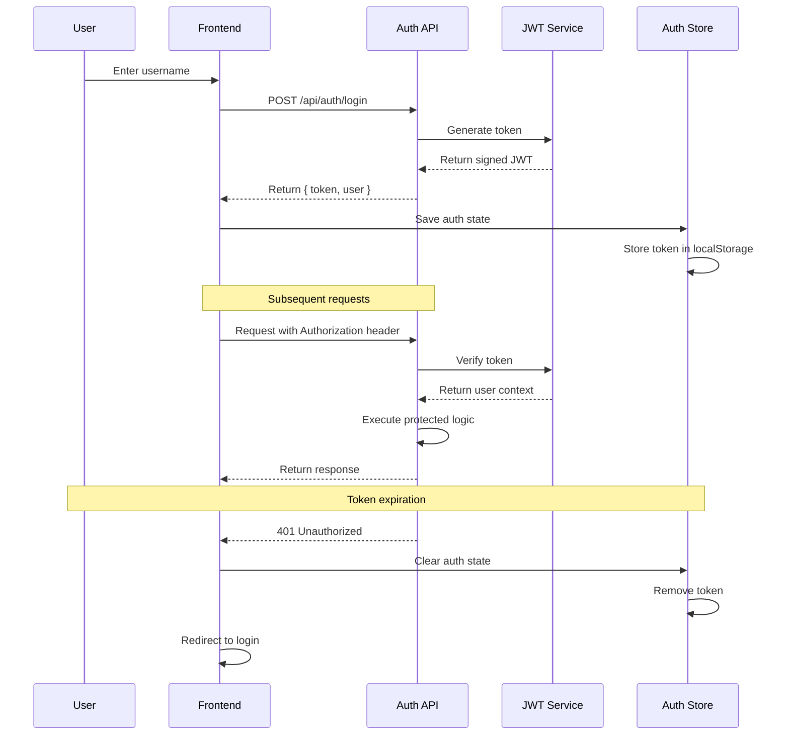

# Backend Architecture

### Service Architecture

Since we're using Next.js with API routes (serverless architecture), we'll organize around function-based services rather than traditional server controllers.

#### Function Organization

```
pages/api/
├── trpc/
│   └── [trpc].ts           # Main tRPC handler
├── auth/
│   ├── login.ts            # Authentication endpoints
│   ├── register.ts
│   └── refresh.ts
├── webhook/
│   └── vercel.ts           # Deployment webhooks
└── health.ts               # Health check endpoint

src/server/
├── routers/                # tRPC route handlers
│   ├── posts.ts           # Post operations
│   ├── users.ts           # User operations
│   ├── reactions.ts       # Reaction operations
│   └── comments.ts        # Comment operations
├── services/              # Business logic
│   ├── postService.ts     # Post management
│   ├── userService.ts     # User management
│   ├── reactionService.ts # Reaction logic
│   └── searchService.ts   # Search functionality
├── middleware/            # Request middleware
│   ├── auth.ts           # JWT validation
│   ├── rateLimit.ts      # Rate limiting
│   └── validation.ts     # Input validation
├── utils/                # Server utilities
│   ├── storage.ts        # Data storage abstraction
│   ├── jwt.ts            # JWT utilities
│   └── errors.ts         # Error handling
└── trpc.ts               # tRPC setup and context
```

#### Function Template

```typescript
// pages/api/trpc/[trpc].ts - Main tRPC handler
import { createNextApiHandler } from '@trpc/server/adapters/next';
import { appRouter } from '../../../server/routers';
import { createTRPCContext } from '../../../server/trpc';

export default createNextApiHandler({
  router: appRouter,
  createContext: createTRPCContext,
  onError: ({ error, type, path, input, ctx, req }) => {
    console.error(`❌ tRPC failed on ${path ?? '<no-path>'}: ${error.message}`);
    
    if (process.env.NODE_ENV === 'development') {
      console.error('Error details:', { type, input, error: error.stack });
    }
  },
});

// Server-side function example
// src/server/services/postService.ts
import { v4 as uuid } from 'uuid';
import { Post, CreatePostInput } from '@/types/shared';
import { storage } from '@/server/utils/storage';
import { extractHashtags } from '@/utils/hashtags';

export class PostService {
  async createPost(input: CreatePostInput & { authorId: string; authorName: string }): Promise<Post> {
    const post: Post = {
      id: uuid(),
      content: input.content,
      authorId: input.authorId,
      authorName: input.authorName,
      createdAt: new Date(),
      updatedAt: new Date(),
      mood: input.mood,
      hashtags: extractHashtags(input.content),
      reactionCount: 0,
      commentCount: 0,
    };

    await storage.posts.create(post);
    return post;
  }

  async getAllPosts(options: { limit?: number; offset?: number } = {}): Promise<Post[]> {
    const { limit = 20, offset = 0 } = options;
    
    const posts = await storage.posts.findMany({
      orderBy: { createdAt: 'desc' },
      limit,
      offset,
    });

    return posts;
  }

  async updatePost(id: string, updates: Partial<Post>, authorId: string): Promise<Post> {
    const existingPost = await storage.posts.findById(id);
    
    if (!existingPost) {
      throw new Error('Post not found');
    }
    
    if (existingPost.authorId !== authorId) {
      throw new Error('Unauthorized to update this post');
    }

    const updatedPost = {
      ...existingPost,
      ...updates,
      updatedAt: new Date(),
      hashtags: updates.content ? extractHashtags(updates.content) : existingPost.hashtags,
    };

    await storage.posts.update(id, updatedPost);
    return updatedPost;
  }

  async deletePost(id: string, authorId: string): Promise<void> {
    const existingPost = await storage.posts.findById(id);
    
    if (!existingPost) {
      throw new Error('Post not found');
    }
    
    if (existingPost.authorId !== authorId) {
      throw new Error('Unauthorized to delete this post');
    }

    await storage.posts.delete(id);
    
    // Clean up associated comments and reactions
    await storage.comments.deleteByPostId(id);
    await storage.reactions.deleteByPostId(id);
  }
}

export const postService = new PostService();
```

### Data Access Layer

```typescript
// src/server/utils/storage.ts - Storage abstraction layer
import fs from 'fs/promises';
import path from 'path';
import { Post, User, Comment, Reaction } from '@/types/shared';

// JSON file storage for MVP
class JSONStorage {
  private dataPath = path.join(process.cwd(), 'data');
  private data: {
    users: Record<string, User>;
    posts: Record<string, Post>;
    comments: Record<string, Comment>;
    reactions: Record<string, Reaction>;
  } | null = null;

  async ensureDataDirectory() {
    try {
      await fs.access(this.dataPath);
    } catch {
      await fs.mkdir(this.dataPath, { recursive: true });
    }
  }

  async loadData() {
    if (this.data) return this.data;

    await this.ensureDataDirectory();
    
    try {
      const dataFile = await fs.readFile(path.join(this.dataPath, 'bailanysta.json'), 'utf-8');
      this.data = JSON.parse(dataFile);
    } catch {
      this.data = { users: {}, posts: {}, comments: {}, reactions: {} };
      await this.saveData();
    }

    return this.data;
  }

  async saveData() {
    if (!this.data) return;
    
    await this.ensureDataDirectory();
    await fs.writeFile(
      path.join(this.dataPath, 'bailanysta.json'),
      JSON.stringify(this.data, null, 2)
    );
  }

  // Post operations
  posts = {
    async create(post: Post): Promise<Post> {
      const data = await this.loadData();
      data.posts[post.id] = post;
      await this.saveData();
      return post;
    },

    async findById(id: string): Promise<Post | null> {
      const data = await this.loadData();
      return data.posts[id] || null;
    },

    async findMany(options: {
      orderBy?: { createdAt: 'asc' | 'desc' };
      limit?: number;
      offset?: number;
    } = {}): Promise<Post[]> {
      const data = await this.loadData();
      let posts = Object.values(data.posts);

      if (options.orderBy?.createdAt) {
        posts.sort((a, b) => {
          const aTime = new Date(a.createdAt).getTime();
          const bTime = new Date(b.createdAt).getTime();
          return options.orderBy!.createdAt === 'desc' ? bTime - aTime : aTime - bTime;
        });
      }

      if (options.offset) {
        posts = posts.slice(options.offset);
      }

      if (options.limit) {
        posts = posts.slice(0, options.limit);
      }

      return posts;
    },

    async update(id: string, updates: Partial<Post>): Promise<Post> {
      const data = await this.loadData();
      const existing = data.posts[id];
      if (!existing) throw new Error('Post not found');
      
      const updated = { ...existing, ...updates };
      data.posts[id] = updated;
      await this.saveData();
      return updated;
    },

    async delete(id: string): Promise<void> {
      const data = await this.loadData();
      delete data.posts[id];
      await this.saveData();
    },

    async findByHashtag(hashtag: string): Promise<Post[]> {
      const data = await this.loadData();
      return Object.values(data.posts)
        .filter(post => post.hashtags.includes(hashtag))
        .sort((a, b) => new Date(b.createdAt).getTime() - new Date(a.createdAt).getTime());
    },
  };

  // Similar implementations for users, comments, reactions...
}

export const storage = new JSONStorage();
```

### Authentication and Authorization

#### Auth Flow



#### Middleware/Guards

```typescript
// src/server/middleware/auth.ts
import jwt from 'jsonwebtoken';
import { TRPCError } from '@trpc/server';
import { User } from '@/types/shared';

const JWT_SECRET = process.env.JWT_SECRET || 'dev-secret-change-in-production';

export interface AuthContext {
  user: User | null;
  isAuthenticated: boolean;
}

export const createAuthContext = async (
  authorization?: string
): Promise<AuthContext> => {
  if (!authorization?.startsWith('Bearer ')) {
    return { user: null, isAuthenticated: false };
  }

  const token = authorization.split(' ')[1];
  
  try {
    const decoded = jwt.verify(token, JWT_SECRET) as { userId: string; username: string };
    
    // In a real app, fetch user from database
    const user: User = {
      id: decoded.userId,
      username: decoded.username,
      joinedAt: new Date(), // Would come from DB
      postCount: 0, // Would come from DB
      preferences: { theme: 'light', language: 'en' },
    };

    return { user, isAuthenticated: true };
  } catch (error) {
    return { user: null, isAuthenticated: false };
  }
};

// tRPC protected procedure
export const protectedProcedure = publicProcedure.use(({ ctx, next }) => {
  if (!ctx.isAuthenticated || !ctx.user) {
    throw new TRPCError({
      code: 'UNAUTHORIZED',
      message: 'Authentication required',
    });
  }

  return next({
    ctx: {
      ...ctx,
      user: ctx.user, // Type narrowing - user is guaranteed to exist
    },
  });
});
```