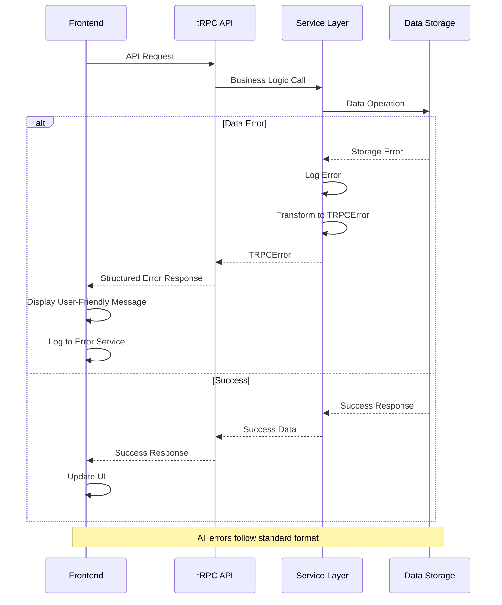

# Coding Standards

### Critical Fullstack Rules

- **Type Sharing:** Always define shared types in `src/types/shared.ts` and import from there - never duplicate interfaces between frontend and backend
- **API Communication:** Never make direct fetch calls - always use tRPC client through `trpc.api.*` patterns for type safety
- **Environment Variables:** Access only through config objects in `src/utils/config.ts`, never `process.env` directly in components
- **Error Handling:** All API routes must use the standard TRPCError format, all frontend errors use the global error boundary
- **State Updates:** Never mutate Zustand state directly - always use store actions and follow immutability patterns
- **Data Validation:** All user inputs must be validated with Zod schemas defined in `src/utils/validation.ts`
- **Authentication:** Always use the `protectedProcedure` wrapper for authenticated routes, never implement auth logic in individual endpoints
- **Storage Operations:** Abstract all data operations through the storage layer - never access JSON files or database directly from services

### Naming Conventions

| Element | Frontend | Backend | Example |
|---------|----------|---------|---------|
| Components | PascalCase | - | `PostCard.tsx`, `UserProfile.tsx` |
| Hooks | camelCase with 'use' | - | `useAuth.ts`, `usePosts.ts` |
| API Routes | - | kebab-case | `/api/trpc`, `/api/auth/login` |
| Database Tables | - | snake_case | `user_profiles`, `post_reactions` |
| tRPC Procedures | - | camelCase | `posts.create`, `users.updateProfile` |
| Store Actions | - | camelCase | `setUser`, `addOptimisticPost` |
| Types/Interfaces | PascalCase | PascalCase | `Post`, `CreatePostInput` |
| Constants | SCREAMING_SNAKE_CASE | SCREAMING_SNAKE_CASE | `MAX_POST_LENGTH`, `JWT_EXPIRES_IN` |

## Error Handling Strategy

### Error Flow



### Error Response Format

```typescript
interface ApiError {
  error: {
    code: string;
    message: string;
    details?: Record<string, any>;
    timestamp: string;
    requestId: string;
  };
}

// Standard error codes
export const ERROR_CODES = {
  // Authentication errors
  UNAUTHORIZED: 'UNAUTHORIZED',
  FORBIDDEN: 'FORBIDDEN',
  TOKEN_EXPIRED: 'TOKEN_EXPIRED',
  
  // Validation errors
  INVALID_INPUT: 'INVALID_INPUT',
  VALIDATION_FAILED: 'VALIDATION_FAILED',
  
  // Resource errors
  NOT_FOUND: 'NOT_FOUND',
  ALREADY_EXISTS: 'ALREADY_EXISTS',
  
  // Rate limiting
  TOO_MANY_REQUESTS: 'TOO_MANY_REQUESTS',
  
  // Server errors
  INTERNAL_ERROR: 'INTERNAL_ERROR',
  DATABASE_ERROR: 'DATABASE_ERROR',
} as const;
```

## Monitoring and Observability

### Monitoring Stack

- **Frontend Monitoring:** Vercel Analytics + Web Vitals tracking for performance metrics
- **Backend Monitoring:** Vercel Functions Analytics for API performance and error rates  
- **Error Tracking:** Console logging (development) with future integration to Sentry for production
- **Performance Monitoring:** Built-in Vercel metrics for response times and function execution

### Key Metrics

**Frontend Metrics:**
- Core Web Vitals (LCP, FID, CLS) for user experience quality
- JavaScript errors and unhandled promise rejections  
- API response times from client perspective
- User interactions (post creation, reactions, comments)
- Bundle size and loading performance

**Backend Metrics:**
- Request rate per endpoint and user
- Error rate by error type and endpoint
- Response time percentiles (p50, p95, p99)
- Database query performance and storage operations
- Function cold start times and memory usage

## Security and Performance

### Security Requirements

**Frontend Security:**
- CSP Headers: `default-src 'self'; script-src 'self' 'unsafe-eval'; style-src 'self' 'unsafe-inline'; img-src 'self' data: https:; connect-src 'self' https://api.vercel.com;`
- XSS Prevention: Content sanitization using DOMPurify, CSP headers, React's built-in XSS protection
- Secure Storage: JWT tokens in httpOnly cookies (production), localStorage with expiration (development)

**Backend Security:**
- Input Validation: Zod schemas for all API inputs with strict type checking and sanitization
- Rate Limiting: 100 requests per 15-minute window per IP, 1000 requests per hour for authenticated users
- CORS Policy: `{ origin: process.env.NEXT_PUBLIC_APP_URL, credentials: true, methods: ['GET', 'POST', 'PUT', 'DELETE'] }`

**Authentication Security:**
- Token Storage: JWT in httpOnly cookies with 7-day expiration and automatic refresh
- Session Management: Stateless JWT-based sessions with sliding expiration
- Password Policy: N/A for MVP (no passwords), future: 8+ chars, mixed case, numbers, symbols

### Performance Optimization

**Frontend Performance:**
- Bundle Size Target: <500KB initial bundle, <200KB per route
- Loading Strategy: Code splitting per route, lazy loading for modals, preloading for likely navigation
- Caching Strategy: SWR for API data, browser cache for static assets, service worker for offline support (future)

**Backend Performance:**
- Response Time Target: <100ms for cached data, <500ms for database queries
- Database Optimization: Denormalized counters, indexed queries, connection pooling (future PostgreSQL)
- Caching Strategy: Vercel KV for API responses, Edge caching for static content, CDN for global distribution