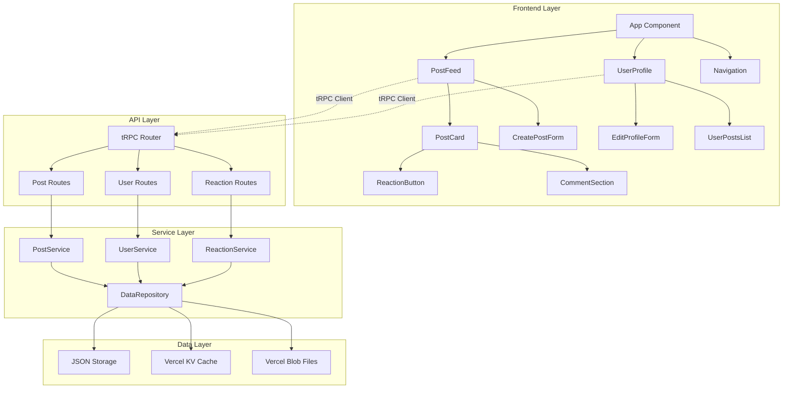

# Components

### Frontend Components

#### PostFeed Component

**Responsibility:** Displays chronological list of all posts with infinite scrolling and real-time updates

**Key Interfaces:**
- `useInfiniteQuery` for paginated post loading
- `useMutation` for post creation from embedded form
- WebSocket connection for real-time post updates

**Dependencies:** PostCard, CreatePostForm, InfiniteScroll utilities

**Technology Stack:** React 18 with Suspense, TanStack Query for data fetching, Framer Motion for animations

#### PostCard Component

**Responsibility:** Individual post display with reactions, comments, and management actions

**Key Interfaces:**
- `toggleReaction` mutation for heart interactions
- `deletePost` mutation for post management
- Comment expansion/collapse state management

**Dependencies:** ReactionButton, CommentSection, PostActions

**Technology Stack:** React with optimistic updates, Tailwind for styling, HeadlessUI for accessible interactions

#### UserProfileManager Component

**Responsibility:** User profile display and editing with post management capabilities

**Key Interfaces:**
- `updateProfile` mutation for profile changes
- `getUserPosts` query for user's post history
- Profile image upload (future phase)

**Dependencies:** PostCard, EditProfileForm, UserAvatar

**Technology Stack:** React Hook Form for form management, Zod validation, optimistic UI updates

### Backend Services

#### PostService

**Responsibility:** Core business logic for post creation, retrieval, and management

**Key Interfaces:**
- `createPost(data: CreatePostInput): Promise<Post>`
- `getAllPosts(pagination: PaginationParams): Promise<PostsResponse>`
- `updatePost(id: string, data: UpdatePostInput, userId: string): Promise<Post>`

**Dependencies:** DataRepository, HashtagExtractor, ValidationService

**Technology Stack:** TypeScript service classes, Zod validation, JSON file storage with migration path to Vercel KV

#### ReactionService

**Responsibility:** Manages user reactions to posts with real-time updates

**Key Interfaces:**
- `toggleReaction(data: ReactionInput): Promise<ReactionResponse>`
- `getReactionsByPost(postId: string): Promise<Reaction[]>`
- Real-time reaction count updates

**Dependencies:** DataRepository, NotificationService (future)

**Technology Stack:** Optimistic locking for concurrent reactions, denormalized counters for performance

#### UserService

**Responsibility:** User management, authentication, and profile operations

**Key Interfaces:**
- `createUser(data: CreateUserInput): Promise<User>`
- `updateUser(id: string, data: UpdateUserInput): Promise<User>`
- `getUserProfile(id: string): Promise<UserProfile>`

**Dependencies:** AuthService, ValidationService, ProfileImageService (future)

**Technology Stack:** JWT token management, bcrypt for password hashing (future), profile data validation

### Component Diagrams

