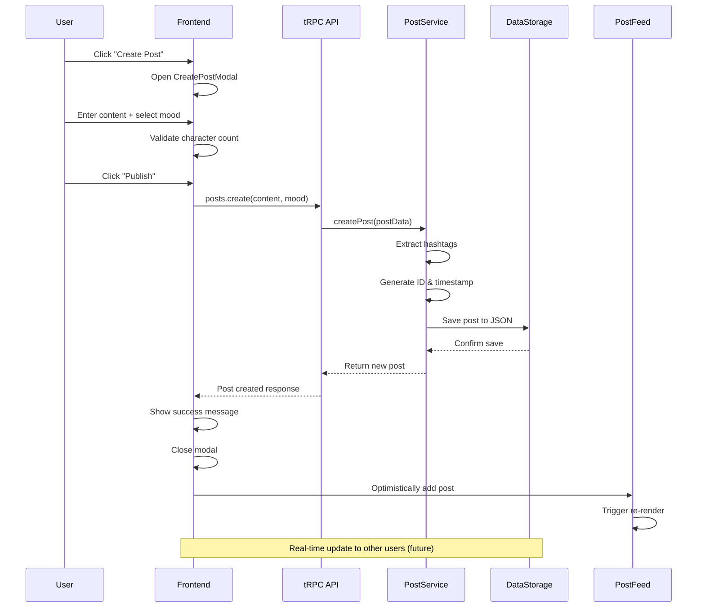
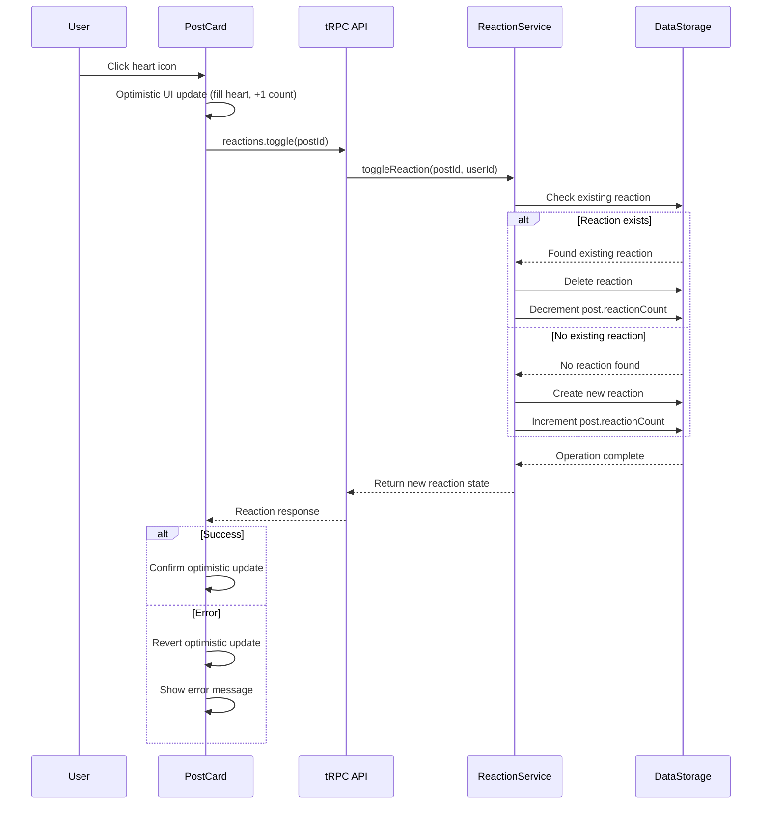

# Core Workflows

### Post Creation and Display Workflow

```mermaid
sequenceDiagram
    participant U as User
    participant FE as Frontend
    participant API as tRPC API
    participant PS as PostService
    participant DS as DataStorage
    participant Feed as PostFeed

    U->>FE: Click "Create Post"
    FE->>FE: Open CreatePostModal
    U->>FE: Enter content + select mood
    FE->>FE: Validate character count
    U->>FE: Click "Publish"
    
    FE->>API: posts.create(content, mood)
    API->>PS: createPost(postData)
    PS->>PS: Extract hashtags
    PS->>PS: Generate ID & timestamp
    PS->>DS: Save post to JSON
    DS-->>PS: Confirm save
    PS-->>API: Return new post
    API-->>FE: Post created response
    
    FE->>FE: Show success message
    FE->>FE: Close modal
    FE->>Feed: Optimistically add post
    Feed->>Feed: Trigger re-render
    
    Note over FE,DS: Real-time update to other users (future)
```

### Reaction Workflow with Optimistic Updates

```mermaid
sequenceDiagram
    participant U as User
    participant PC as PostCard
    participant API as tRPC API
    participant RS as ReactionService
    participant DS as DataStorage

    U->>PC: Click heart icon
    PC->>PC: Optimistic UI update (fill heart, +1 count)
    
    PC->>API: reactions.toggle(postId)
    API->>RS: toggleReaction(postId, userId)
    RS->>DS: Check existing reaction
    
    alt Reaction exists
        DS-->>RS: Found existing reaction
        RS->>DS: Delete reaction
        RS->>DS: Decrement post.reactionCount
    else No existing reaction
        DS-->>RS: No reaction found
        RS->>DS: Create new reaction
        RS->>DS: Increment post.reactionCount
    end
    
    DS-->>RS: Operation complete
    RS-->>API: Return new reaction state
    API-->>PC: Reaction response
    
    alt Success
        PC->>PC: Confirm optimistic update
    else Error
        PC->>PC: Revert optimistic update
        PC->>PC: Show error message
    end
```