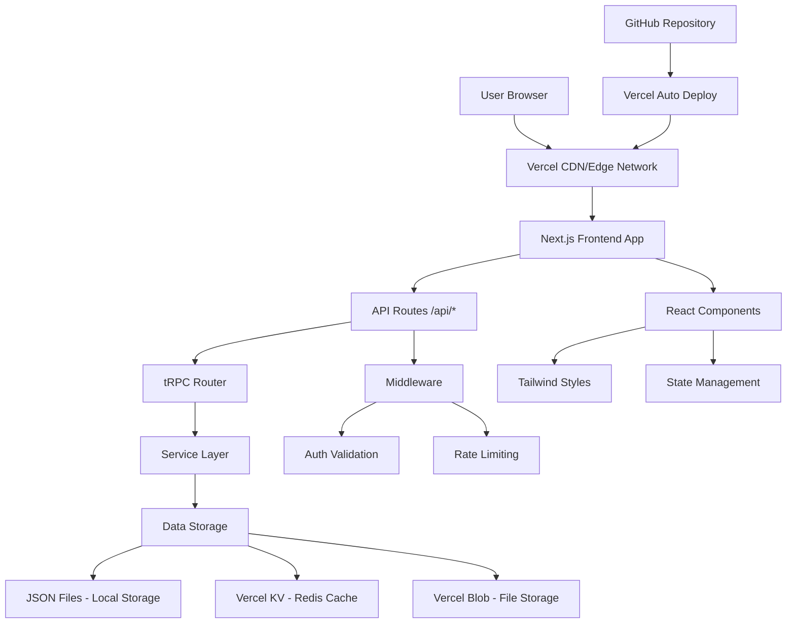

# Bailanysta Architecture Overview

## Introduction

This document outlines the complete fullstack architecture for Bailanysta, including backend systems, frontend implementation, and their integration. It serves as the single source of truth for AI-driven development, ensuring consistency across the entire technology stack.

This unified approach combines what would traditionally be separate backend and frontend architecture documents, streamlining the development process for modern fullstack applications where these concerns are increasingly intertwined.

### Starter Template or Existing Project

**N/A - Greenfield project**

Based on the PRD requirements for rapid 2-3 hour MVP development, we'll create a greenfield React application optimized for speed. We'll leverage Vite for rapid development, Tailwind for quick styling, and focus on minimal viable architecture that can scale.

### Change Log

| Date | Version | Description | Author |
|------|---------|-------------|---------|
| 2025-08-31 | 1.0 | Initial fullstack architecture based on PRD and front-end specs | Winston (Architect) |

## High Level Architecture

### Technical Summary

Bailanysta employs a modern Jamstack architecture with React frontend and serverless backend, deployed on Vercel for optimal performance and developer experience. The frontend uses React 18 with Vite build tooling and Tailwind CSS for rapid development, while the backend leverages Vercel Edge Functions for API routes with JSON file storage for MVP simplicity. Key integration points include tRPC for type-safe API communication, shared TypeScript interfaces for data consistency, and Vercel's deployment platform for seamless frontend-backend integration. This architecture prioritizes the PRD's 2-3 hour development timeline while maintaining scalable component patterns for future enhancement phases.

### Platform and Infrastructure Choice

**Platform:** Vercel  
**Key Services:** Vercel Edge Functions, Vercel KV (Redis), Vercel Blob Storage, GitHub for CI/CD  
**Deployment Host and Regions:** Global Edge Network with primary regions US-East, EU-West

**Rationale:** Vercel provides optimal integration for React/Next.js applications with zero-config deployment, built-in edge functions for serverless API, and excellent performance. The platform supports the PRD's requirement for free hosting while enabling seamless progression from JSON storage to cloud databases.

### Repository Structure

**Structure:** Monorepo with Frontend-Backend Integration  
**Monorepo Tool:** npm workspaces (lightweight, no additional tooling needed)  
**Package Organization:** Unified Next.js app with API routes, shared types package

**Rationale:** Next.js provides the optimal balance of frontend and backend integration for rapid development, eliminating the complexity of separate repositories while maintaining clear separation of concerns.

### High Level Architecture Diagram

### Architectural Patterns

- **Jamstack Architecture:** Static generation with serverless APIs - _Rationale:_ Optimal performance and scalability for content-heavy social applications with global distribution
- **Component-Based UI:** Reusable React components with TypeScript - _Rationale:_ Maintainability and type safety critical for rapid development and future scaling
- **API-First Design:** tRPC for type-safe client-server communication - _Rationale:_ Eliminates API documentation overhead and provides end-to-end type safety
- **Progressive Enhancement:** Core functionality without JavaScript, enhanced with React - _Rationale:_ Ensures 30-second user validation works even with poor network conditions
- **Edge-First Computing:** API routes run on Vercel Edge Runtime - _Rationale:_ Sub-100ms response times globally, meeting NFR4 performance requirements
- **File-Based Routing:** Next.js pages and API routes - _Rationale:_ Reduces configuration overhead and enables rapid feature development