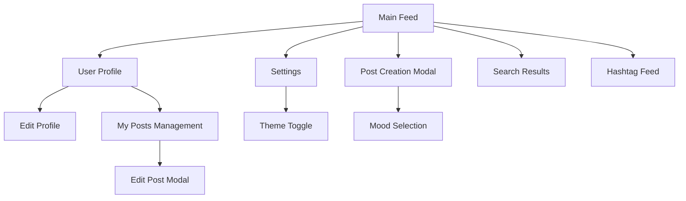
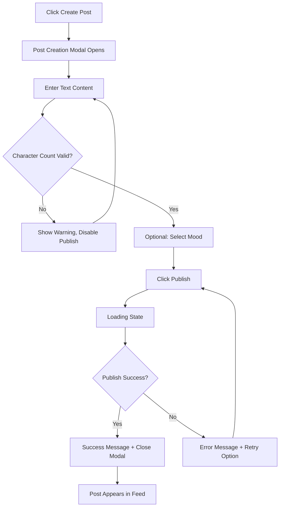
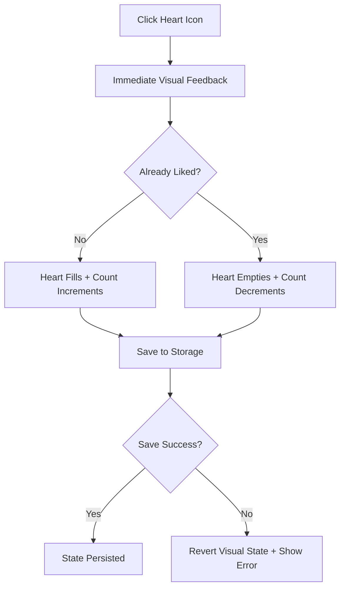
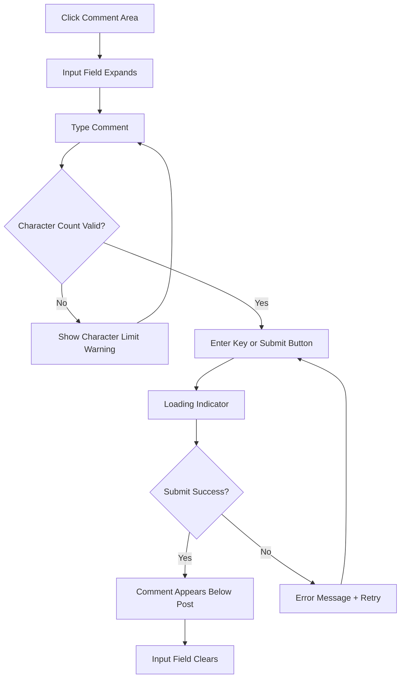
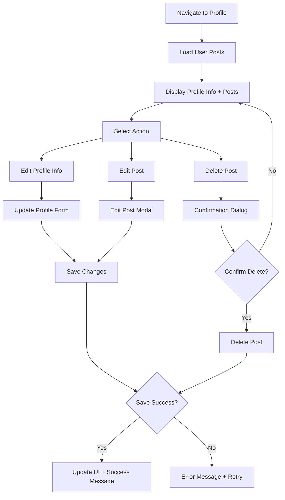

# Bailanysta UI/UX Specification

> **Note:** This document has been sharded for better organization and maintainability. See the individual sections in the `docs/front-end-spec/` folder for detailed content.

## Front-End Specification Sections

- **[Overview](./front-end-spec/overview.md)** - UX goals, principles, and personas
- **[Information Architecture](./front-end-spec/information-architecture.md)** - Site map and navigation structure
- **[User Flows](./front-end-spec/user-flows.md)** - Key interaction flows and edge cases
- **[Wireframes & Mockups](./front-end-spec/wireframes-mockups.md)** - Screen layouts and design files
- **[Component Library](./front-end-spec/component-library.md)** - Design system and core components
- **[Branding & Style Guide](./front-end-spec/branding-style-guide.md)** - Colors, typography, and iconography
- **[Accessibility Requirements](./front-end-spec/accessibility-requirements.md)** - WCAG compliance and testing strategy
- **[Responsiveness Strategy](./front-end-spec/responsiveness-strategy.md)** - Breakpoints and adaptation patterns
- **[Animation & Micro-interactions](./front-end-spec/animation-micro-interactions.md)** - Motion principles and performance considerations

## Introduction

This document defines the user experience goals, information architecture, user flows, and visual design specifications for Bailanysta's user interface. It serves as the foundation for visual design and frontend development, ensuring a cohesive and user-centered experience.

### Overall UX Goals & Principles

#### Target User Personas

**Casual Social User:** Пользователи, ищущие аутентичное социальное взаимодействие без перегруженности функциями. Ценят простоту, быстрый доступ к контенту и минималистичный интерфейс.

**Content Creator:** Пользователи, которые активно создают контент и хотят делиться мыслями, получать обратную связь через лайки и комментарии. Нуждаются в эффективных инструментах создания и управления постами.

**Community Seeker:** Пользователи, интересующиеся тематическими обсуждениями через хештеги и поиск. Ценят возможность находить релевантный контент и участвовать в нишевых сообществах.

#### Usability Goals

- **30-секундная валидация:** Новые пользователи могут понять ценность продукта и выполнить основные действия за 30 секунд
- **Мгновенная обратная связь:** Все взаимодействия (лайки, комментарии, публикация) отвечают в пределах 100мс
- **Простота создания контента:** Публикация поста за максимум 3 клика
- **Интуитивная навигация:** Переход между основными разделами без когнитивной нагрузки
- **Доступность:** Поддержка клавиатурной навигации и скрин-ридеров для всех ключевых функций

#### Design Principles

1. **Простота превыше изощренности** - Приоритет четкой коммуникации над эстетическими новшествами
2. **Мгновенная обратная связь** - Каждое действие имеет четкий, немедленный визуальный ответ
3. **Прогрессивное раскрытие** - Показывать только необходимую информацию, когда она нужна
4. **Эмоциональная связь** - Дизайн поддерживает аутентичное выражение эмоций через реакции и настроения
5. **Доступность по умолчанию** - Дизайн учитывает потребности всех пользователей с самого начала

#### Change Log

| Date | Version | Description | Author |
|------|---------|-------------|---------|
| 2025-08-31 | 1.0 | Initial UI/UX specification based on Bailanysta PRD | Sally (UX Expert) |

## Information Architecture (IA)

### Site Map / Screen Inventory

### Navigation Structure

**Primary Navigation:** 
- Main Feed (Home icon) - центральная лента всех постов
- Profile (User icon) - личный профиль и управление постами  
- Create Post (Plus icon) - быстрое создание нового поста
- Settings (Gear icon) - настройки темы и предпочтений

**Secondary Navigation:** 
- Search bar в верхней части для поиска по постам и хештегам
- Theme toggle в настройках
- Hashtag links внутри постов для фильтрации контента

**Breadcrumb Strategy:** 
Минималистичная навигация без breadcrumbs, так как архитектура плоская. Используется четкий visual hierarchy и кнопка "Back" где необходимо.

## User Flows

### Post Creation Flow

**User Goal:** Быстро создать и опубликовать текстовый пост с опциональным настроением

**Entry Points:** 
- Кнопка "+" в главной навигации
- Floating Action Button на мобильных
- Empty state message в ленте

**Success Criteria:** Пост опубликован и появляется в ленте с корректным timestamp

#### Flow Diagram

#### Edge Cases & Error Handling:
- Пустой пост: блокировка кнопки публикации с подсказкой
- Превышение лимита символов: real-time подсчет с визуальным предупреждением
- Ошибка сохранения: retry механизм с сохранением введенного текста
- Потеря интернет-соединения: draft автосохранение в localStorage

**Notes:** Mood selection - уникальная фича Bailanysta для эмоционального контекста постов

### Reaction Flow

**User Goal:** Выразить appreciation к посту одним кликом

**Entry Points:** Heart icon на любом посту в ленте или профиле

**Success Criteria:** Реакция зарегистрирована с мгновенным visual feedback

#### Flow Diagram

#### Edge Cases & Error Handling:
- Rapid clicking: debouncing для предотвращения множественных запросов
- Network error: optimistic UI с rollback при ошибке
- Storage full: graceful degradation с уведомлением пользователя

**Notes:** Анимация сердечка должна быть satisfying но не отвлекающая (~200ms duration)

### Comment Flow

**User Goal:** Добавить комментарий к посту для начала диалога

**Entry Points:** Comment icon или поле "Add comment" под постом

**Success Criteria:** Комментарий сохранен и отображается под постом

#### Flow Diagram

#### Edge Cases & Error Handling:
- Пустой комментарий: disabled submit button
- Превышение лимита: real-time counter с визуальным предупреждением
- Ошибка отправки: сохранение текста + retry опция
- Спам prevention: простой rate limiting (1 комментарий в 5 секунд)

### Profile Management Flow

**User Goal:** Просмотреть и редактировать свои посты, обновить профильную информацию

**Entry Points:** Profile icon в главной навигации

**Success Criteria:** Изменения сохранены и отражены во всех views

#### Flow Diagram

#### Edge Cases & Error Handling:
- Случайное удаление: обязательная confirmation dialog
- Потеря изменений: auto-save draft functionality
- Конфликт версий: simple last-write-wins с уведомлением
- Пустое имя пользователя: валидация с fallback на default name

## Wireframes & Mockups

**Primary Design Files:** [Ссылка будет добавлена при создании в Figma/v0]

### Key Screen Layouts

#### Main Feed Layout

**Purpose:** Центральный hub для просмотра всех постов с возможностью быстрого взаимодействия

**Key Elements:**
- Sticky navigation header с логотипом, поиском, профилем
- Floating action button "+" для создания поста
- Post cards с author, content, timestamp, reactions, comments
- Infinite scroll для дополнительного контента
- Empty state с call-to-action для первого поста

**Interaction Notes:** 
- Pull-to-refresh для обновления ленты
- Smooth scrolling с lazy loading
- Heart animation при клике (scale + color transition)
- Keyboard navigation support для accessibility

**Design File Reference:** [main-feed-layout.frame]

#### Post Creation Modal

**Purpose:** Focused environment для создания контента без отвлекающих элементов

**Key Elements:**
- Large text area с placeholder "What's on your mind?"
- Character counter (280/280) с цветовыми индикаторами
- Mood selector buttons (Happy, Thoughtful, Excited, etc.)
- Cancel и Publish кнопки
- Auto-expanding текстовое поле

**Interaction Notes:**
- Modal overlay с backdrop blur
- Auto-focus на текстовое поле при открытии
- Real-time character counting
- Disabled publish button для invalid states
- Escape key для закрытия

**Design File Reference:** [post-creation-modal.frame]

#### Profile Page Layout

**Purpose:** Персональный dashboard для управления контентом и профильной информацией

**Key Elements:**
- Profile header с avatar, name, bio, join date
- Edit profile button для владельца
- Tabs: "My Posts" (default), "Liked Posts"
- Grid/list view toggle для постов
- Post management actions (edit/delete) на собственных постах

**Interaction Notes:**
- Editable profile info с inline editing
- Confirmation dialogs для destructive actions
- Smooth transitions между tabs
- Responsive layout для mobile/desktop

**Design File Reference:** [profile-page-layout.frame]

## Component Library / Design System

**Design System Approach:** Создание легкой design system с фокусом на социальные взаимодействия. Использование существующих паттернов (Material/iOS) с уникальными акцентами для mood-based features.

### Core Components

#### Post Card Component

**Purpose:** Основной строительный блок для отображения пользовательского контента

**Variants:**
- Standard post (default)
- Own post (с управляющими кнопками)
- Mood post (с эмоциональными индикаторами)

**States:**
- Default, Hover, Loading
- Liked/Unliked для heart button
- Expanded/Collapsed для длинного контента

**Usage Guidelines:** 
- Максимальная высота 300px с scroll для длинного контента
- Consistent padding (16px) и typography scale
- Mood indicators через subtle color accents

#### Reaction Button Component

**Purpose:** Универсальная кнопка для эмоциональных реакций (лайки, дислайки в будущем)

**Variants:**
- Heart (primary reaction)
- Future: Laugh, Sad, Angry для расширенных эмоций

**States:**
- Inactive (outline), Active (filled), Disabled, Loading
- Hover animation (scale 1.1)
- Click animation (bounce + color change)

**Usage Guidelines:**
- Minimum touch target 44px для accessibility
- Consistent animation timing (200ms ease-out)
- Color inheritance от theme system

#### Input Field Component

**Purpose:** Универсальное поле ввода для постов, комментариев, поиска

**Variants:**
- Single line (search, username)
- Multi-line (post creation, comments)
- With character counter
- With mood selector

**States:**
- Empty, Typing, Valid, Invalid, Disabled
- Focus states с border color changes
- Error states с validation messages

**Usage Guidelines:**
- Consistent placeholder text styling
- Auto-resize для multi-line inputs
- Clear validation error messaging

## Branding & Style Guide

**Brand Guidelines:** [Ссылка на brand guide, если существует]

### Color Palette

| Color Type | Hex Code | Usage |
|------------|----------|--------|
| Primary | #6366F1 | Primary actions, links, brand elements |
| Secondary | #8B5CF6 | Secondary actions, highlights |
| Accent | #F59E0B | Mood indicators, special states |
| Success | #10B981 | Success messages, positive feedback |
| Warning | #F59E0B | Warnings, character limit alerts |
| Error | #EF4444 | Errors, destructive actions |
| Neutral | #6B7280, #9CA3AF, #D1D5DB | Text, borders, backgrounds |

### Typography

#### Font Families
- **Primary:** Inter (clean, modern, excellent readability)
- **Secondary:** SF Pro Display / Roboto (system fallbacks)
- **Monospace:** JetBrains Mono (для кода/технических элементов)

#### Type Scale

| Element | Size | Weight | Line Height |
|---------|------|--------|-------------|
| H1 | 32px | 700 | 1.2 |
| H2 | 24px | 600 | 1.3 |
| H3 | 18px | 600 | 1.4 |
| Body | 16px | 400 | 1.5 |
| Small | 14px | 400 | 1.4 |

### Iconography

**Icon Library:** Heroicons (consistent с Tailwind ecosystem, extensive icon set)

**Usage Guidelines:** 
- 24px standard size для navigation icons
- 16px для inline icons в тексте
- Consistent stroke width (2px)
- Accessible alternative text для всех icons

### Spacing & Layout

**Grid System:** 
- 12-column grid для desktop
- Flexible grid для mobile (4-column)
- Container max-width: 1200px
- Gutter: 24px desktop, 16px mobile

**Spacing Scale:** 
- 4px base unit
- Scale: 4, 8, 12, 16, 24, 32, 48, 64px
- Consistent применение через design tokens

## Accessibility Requirements

### Compliance Target

**Standard:** WCAG 2.1 AA compliance с фокусом на социальные interaction patterns

### Key Requirements

**Visual:**
- Color contrast ratios: 4.5:1 для normal text, 3:1 для large text
- Focus indicators: 2px solid outline с high contrast color
- Text sizing: Responsive scaling до 200% без потери функциональности

**Interaction:**
- Keyboard navigation: Tab order через все interactive elements
- Screen reader support: Semantic HTML, ARIA labels для dynamic content
- Touch targets: Minimum 44px для mobile interactions

**Content:**
- Alternative text: Descriptive alt text для всех images/icons
- Heading structure: Logical hierarchy H1-H6
- Form labels: Explicit labels для всех form inputs

### Testing Strategy

- Automated testing с axe-core в CI/CD pipeline
- Manual testing с screen readers (NVDA, VoiceOver)
- Keyboard-only navigation testing
- Color blindness simulation для всех UI states

## Responsiveness Strategy

### Breakpoints

| Breakpoint | Min Width | Max Width | Target Devices |
|------------|-----------|-----------|----------------|
| Mobile | 320px | 767px | Phones, small tablets |
| Tablet | 768px | 1023px | iPads, Android tablets |
| Desktop | 1024px | 1439px | Laptops, desktop monitors |
| Wide | 1440px | - | Large monitors, ultrawide displays |

### Adaptation Patterns

**Layout Changes:**
- Mobile: Single column, full-width cards
- Tablet: 2-column grid for posts, sidebar collapse
- Desktop: 3-column layout (sidebar, main content, activity panel)

**Navigation Changes:**
- Mobile: Bottom tab bar, hamburger menu for secondary options
- Tablet: Top navigation with grouped actions
- Desktop: Full horizontal navigation с all options visible

**Content Priority:**
- Mobile-first approach, progressive enhancement
- Critical content always visible
- Secondary features через progressive disclosure

**Interaction Changes:**
- Touch-first design с appropriate target sizes
- Hover states для desktop
- Gesture support (swipe для navigation где appropriate)

## Animation & Micro-interactions

### Motion Principles

- **Purposeful:** Анимации поддерживают user understanding
- **Responsive:** Duration based на distance (closer objects move faster)
- **Natural:** Easing curves имитируют natural motion
- **Respectful:** Respect для prefers-reduced-motion setting

### Key Animations

- **Heart Like Animation:** Scale from 1.0 to 1.2 to 1.0, color change from gray to red (Duration: 300ms, Easing: cubic-bezier(0.68, -0.55, 0.265, 1.55))
- **Post Card Hover:** Subtle lift effect с shadow увеличением (Duration: 200ms, Easing: ease-out)
- **Modal Slide-In:** Slide from bottom на mobile, fade-in на desktop (Duration: 250ms, Easing: ease-out)
- **Loading Spinner:** Continuous rotation для async operations (Duration: 1000ms, Easing: linear)
- **Character Counter Warning:** Gentle color transition к warning state (Duration: 150ms, Easing: ease-in-out)
- **Toast Notifications:** Slide-in from top с auto-dismiss (Duration: 300ms in, 200ms out, Easing: ease-out)

## Performance Considerations

### Performance Goals

- **Page Load:** Initial load под 2 секунды на 3G connection
- **Interaction Response:** UI feedback в течение 100ms для всех actions
- **Animation FPS:** Maintain 60fps для всех animations

### Design Strategies

- **Image Optimization:** Responsive images с appropriate sizing
- **Progressive Loading:** Skeleton screens во время загрузки content
- **Virtual Scrolling:** Для длинных lists (100+ items)
- **Code Splitting:** Component-level splitting для larger features
- **Critical CSS:** Inline critical styles для faster первый render
- **Prefetching:** Anticipatory loading для likely user actions

## Next Steps

### Immediate Actions

1. **Create visual mockups в Figma/v0** на основе wireframes
2. **Design comprehensive component library** со всеми states
3. **Prototype key user flows** для usability testing
4. **Validate accessibility approach** с screen reader testing
5. **Create responsive breakpoint examples** для development handoff

### Design Handoff Checklist

- [x] All user flows documented
- [x] Component inventory complete  
- [x] Accessibility requirements defined
- [x] Responsive strategy clear
- [x] Brand guidelines incorporated
- [x] Performance goals established

### Architecture Handoff Notes

Этот документ готов для передачи Design Architect для создания технической архитектуры фронтенда. Ключевые моменты для архитектора:

1. **Component-First Approach:** Все UI elements спроектированы как reusable components
2. **State Management Needs:** User preferences (theme), post data, interaction states
3. **Performance Critical Paths:** Post creation flow, infinite scroll, real-time reactions
4. **Accessibility Integration Points:** Keyboard navigation, screen reader support, ARIA labels
5. **Animation Performance:** CSS transforms приоритетны над JavaScript animations

---

*Документ создан Sally (UX Expert) на основе Bailanysta PRD для обеспечения user-centered design approach.*