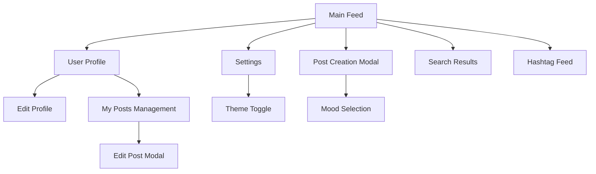

# Information Architecture (IA)

### Site Map / Screen Inventory

### Navigation Structure

**Primary Navigation:** 
- Main Feed (Home icon) - центральная лента всех постов
- Profile (User icon) - личный профиль и управление постами  
- Create Post (Plus icon) - быстрое создание нового поста
- Settings (Gear icon) - настройки темы и предпочтений

**Secondary Navigation:** 
- Search bar в верхней части для поиска по постам и хештегам
- Theme toggle в настройках
- Hashtag links внутри постов для фильтрации контента

**Breadcrumb Strategy:** 
Минималистичная навигация без breadcrumbs, так как архитектура плоская. Используется четкий visual hierarchy и кнопка "Back" где необходимо.