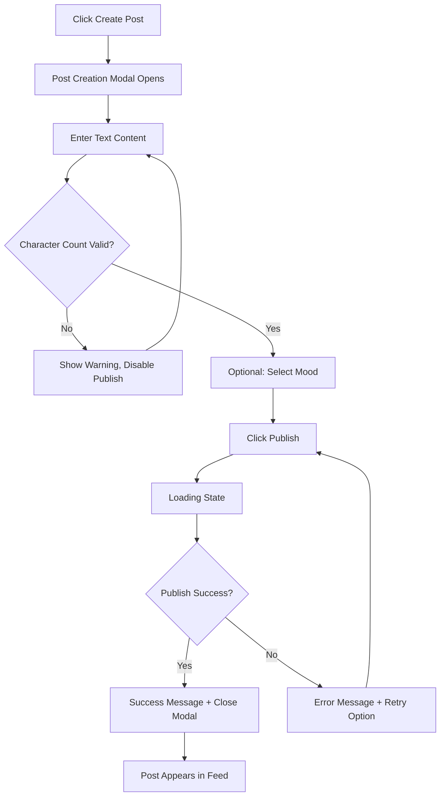
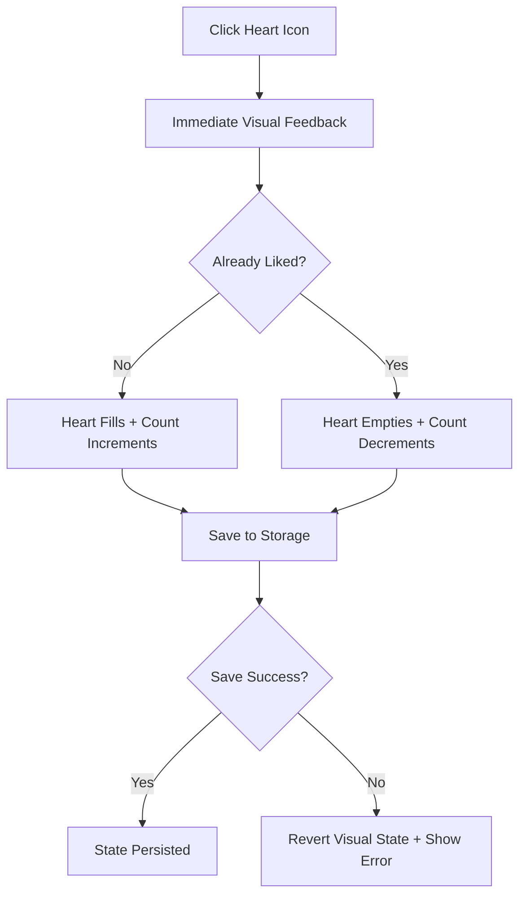
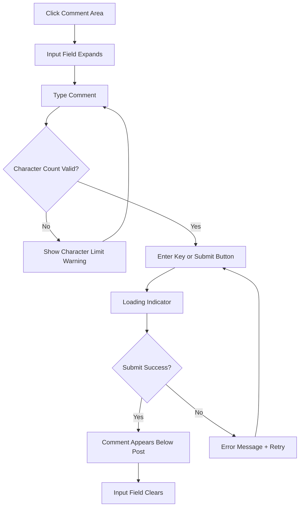
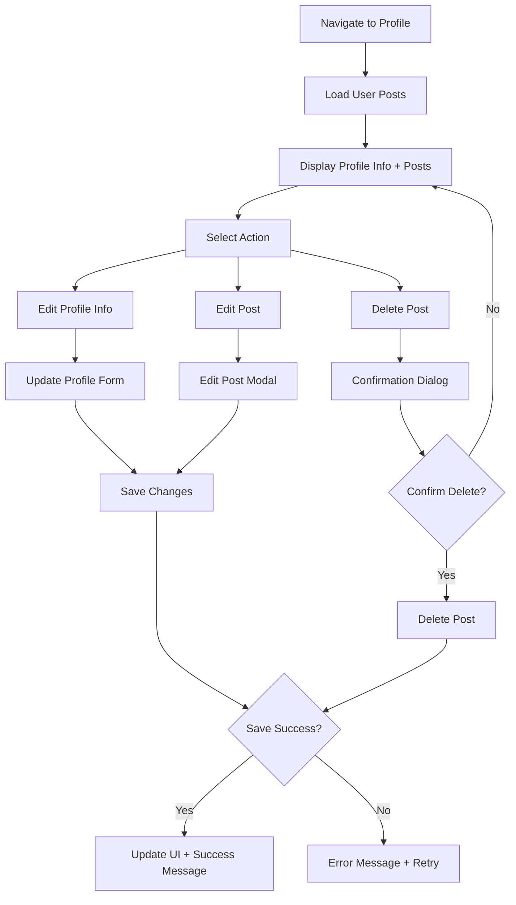

# User Flows

### Post Creation Flow

**User Goal:** Быстро создать и опубликовать текстовый пост с опциональным настроением

**Entry Points:** 
- Кнопка "+" в главной навигации
- Floating Action Button на мобильных
- Empty state message в ленте

**Success Criteria:** Пост опубликован и появляется в ленте с корректным timestamp

#### Flow Diagram

#### Edge Cases & Error Handling:
- Пустой пост: блокировка кнопки публикации с подсказкой
- Превышение лимита символов: real-time подсчет с визуальным предупреждением
- Ошибка сохранения: retry механизм с сохранением введенного текста
- Потеря интернет-соединения: draft автосохранение в localStorage

**Notes:** Mood selection - уникальная фича Bailanysta для эмоционального контекста постов

### Reaction Flow

**User Goal:** Выразить appreciation к посту одним кликом

**Entry Points:** Heart icon на любом посту в ленте или профиле

**Success Criteria:** Реакция зарегистрирована с мгновенным visual feedback

#### Flow Diagram

#### Edge Cases & Error Handling:
- Rapid clicking: debouncing для предотвращения множественных запросов
- Network error: optimistic UI с rollback при ошибке
- Storage full: graceful degradation с уведомлением пользователя

**Notes:** Анимация сердечка должна быть satisfying но не отвлекающая (~200ms duration)

### Comment Flow

**User Goal:** Добавить комментарий к посту для начала диалога

**Entry Points:** Comment icon или поле "Add comment" под постом

**Success Criteria:** Комментарий сохранен и отображается под постом

#### Flow Diagram

#### Edge Cases & Error Handling:
- Пустой комментарий: disabled submit button
- Превышение лимита: real-time counter с визуальным предупреждением
- Ошибка отправки: сохранение текста + retry опция
- Спам prevention: простой rate limiting (1 комментарий в 5 секунд)

### Profile Management Flow

**User Goal:** Просмотреть и редактировать свои посты, обновить профильную информацию

**Entry Points:** Profile icon в главной навигации

**Success Criteria:** Изменения сохранены и отражены во всех views

#### Flow Diagram

#### Edge Cases & Error Handling:
- Случайное удаление: обязательная confirmation dialog
- Потеря изменений: auto-save draft functionality
- Конфликт версий: simple last-write-wins с уведомлением
- Пустое имя пользователя: валидация с fallback на default name